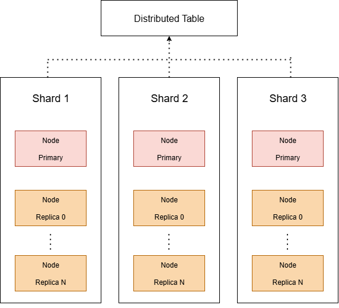

:::warning
本文會稍微講述分散式系統的基本定義和概念，所以請各位放心食用（小孩愛吃）。
:::

隨著資料量從 TB 級別成長至 PB 級別，單機架構顯然無法應付現代資料分析與即時查詢的需求。ClickHouse 透過 **Distributed Table 與分布式查詢架構**，讓資料能夠橫向擴展到**數十、數百台節點**，並在龐大資料量下依然維持秒級查詢回應。

## 什麼是 Distributed Table？

Distributed Table 並不是**實際存放資料的表**，而是 ClickHouse 提供的 **查詢路由代理 (Query Router)**。它的作用是：

* 接收分布式查詢請求。
* 將查詢根據分片 (Shard) 規則分派至對應的資料節點 (Shard / Replica)。
* 收集各分片節點的查詢結果後，進行合併 (Merge) 回傳給使用者。

### 核心概念：

| 名稱                | 說明                                    |
| ----------------- | ------------------------------------- |
| Shard        | 水平切分資料的單位，每個分片儲存資料的子集。                |
| Replica      | 同一 Shard 的多個副本，保證高可用性與讀取負載平衡。         |
| Distributed Table | 路由器角色，負責將查詢請求分派至正確的 Shard/Replica 節點。 |
| Remote Table      | 真正儲存資料的表 (通常為 MergeTree 或其變種引擎)。      |



> 自己做的

## 語法與配置

### 1. 建立 Remote Table (實際儲存資料的表)

```sql
CREATE TABLE cluster_shard.local_visits
(
    Date Date,
    UserID UInt64,
    PageViews UInt32
) ENGINE = MergeTree()
ORDER BY (Date, UserID);
```

### 2. 建立 Distributed Table (分布式查詢路由表)

:::warning
在 ClickHouse Cloud 中，若要建立 distributed table，是不支援 **Distributed(...)** 的，請改使用 [remote/remoteSecure](https://clickhouse.com/docs/sql-reference/table-functions/remote) 來實作。
:::

```sql
CREATE TABLE [IF NOT EXISTS] [db.]table_name [ON CLUSTER cluster] AS [db2.]name2 ENGINE = Distributed(cluster, database, table[, sharding_key[, policy_name]]) [SETTINGS name=value, ...]
```

```sql
CREATE TABLE cluster_shard.distributed_visits
AS cluster_shard.local_visits
ENGINE = Distributed(cluster_name, 'cluster_shard', local_visits, rand());
```

### 參數說明：

| 參數               | 說明                                      |
| ---------------- | --------------------------------------- |
| `cluster_name`    | 定義於 clusters.xml 的叢集名稱。                 |
| `cluster_shard` | 資料庫名稱 (Database)。                       |
| `local_visits`    | Remote Table 名稱 (目標資料表)。                |
| `rand()`           | 分片選擇策略，常見還有 `sharding_key()` 用於精確控制分片邏輯。 |

### 分片策略設計

| 策略                         | 說明                                               |
| -------------------------- | ------------------------------------------------ |
| `rand()`                     | 隨機分片，適用於無明確切分邏輯、但需均衡寫入負載的場景。                     |
| `cityHash64(UserID) % N`     | 根據 UserID 做 Hash 切分，保證相同 UserID 資料會落在同一 Shard 上。 |
| `toYYYYMM(Date) % N`         | 根據時間維度做切分，適合時間序列資料，如日誌分析、感測器資料。                  |
| Sharding Expression (任意欄位) | 可自由設定複合欄位作為分片鍵，根據業務邏輯優化查詢裁剪 (Data Skipping)。     |

#### 設計建議：

* 維持分片數量與資料量均衡 (避免資料傾斜)。
* 分片鍵選擇應盡量與**查詢 WHERE 條件一致**，提升 Data Skipping 效率。
* 盡可能避免查詢跨所有 Shard (如無分片條件的全表掃描)。

## 分片與副本架構

| 結構元件                          | 說明                                     |
| ----------------------------- | -------------------------------------- |
| Shard                         | 水平切分資料的單位，資料只儲存在該分片內的副本節點上。            |
| Replica                       | 同一 Shard 的多個副本，儲存完全相同的資料，支援高可用性與讀負載均衡。 |
| Zookeeper / ClickHouse Keeper | 負責 Replica 間的同步與叢集協調 (如故障轉移)。          |

## 分布式查詢的運作流程

1. **Client 發起查詢 (Distributed Table)**。
2. Distributed Table 根據 Sharding Key (或 rand()) 決定分派至哪些 Shard。
3. 每個 Shard 中的 Replica Node 會由 ClickHouse 根據負載自動選擇 (或讀取任意 Replica)。
4. 每個節點執行查詢，將部分結果回傳至 Distributed Table 節點。
5. Distributed Table 節點將來自各 Shard 的結果進行合併 (Merge)，並回傳給 Client。

## Replica 設計策略

| 策略                    | 說明                                          |
| --------------------- | ------------------------------------------- |
| 高可用性             | 當 Primary 節點故障時，自動切換至其他 Replica 節點，保證查詢不中斷。 |
| 讀取負載平衡                | 分散 Read Query 至不同 Replica，減少單點負載壓力。         |
| 寫入一致性 (Quorum Writes) | 重要資料場景可啟用 Quorum，確保寫入時多數副本確認後才視為成功。         |

## 優化方向

| 優化方向                                        | 說明                                         |
| ------------------------------------------- | ------------------------------------------ |
| 查詢裁剪 (Data Skipping)                        | 設計良好的 Partition Key 與 Sharding Key，避免全表掃描。 |
| All-replicas 選項調整                           | 控制查詢時是否讀取所有副本或只讀其中一個，避免不必要的副本同步壓力。         |
| Distributed\_aggregation\_memory\_efficient | 启用記憶體優化的分布式聚合方式，將聚合結果分批合併，降低記憶體消耗。         |
| 設定 preferred\_replica 訪問策略                  | 可透過設定指定節點優先回應查詢，避免每次隨機讀取造成 Cache Miss。     |

## 額外補充

由於內容較多，若有興趣可查看[官方文件](https://clickhouse.com/docs/engines/table-engines/special/distributed)，以下是一些額外補充：

### 1. INSERT, SELECT

| 操作     | 行為說明                                                                                           |
| ------ | ---------------------------------------------------------------------------------------------- |
| INSERT | 依據 Sharding Key 決定資料寫入到對應 Shard，若 internal\_replication=true，則僅寫入一個 Replica，其餘 Replica 透過同步完成。 |
| SELECT | Distributed Table 會並行查詢所有符合條件的 Shard，並合併結果回傳。若條件中有 Sharding Key，則會優化查詢僅對應特定 Shard。             |

### 2. **Distributed Tables 中的 local 節點優先讀取 (prefer\_localhost\_replica)**

* 如果 Distributed Table 與 remote\_servers 中的 Replica 節點為同一台機器，則查詢預設會優先從 Local 節點讀取，減少網路傳輸。
* 這行為由 **prefer\_localhost\_replica** 控制，可強制或禁止此優先行為。

### 3. **Data Skipping with Distributed Table**

* 若 Distributed Table 中的 Remote Table (如 MergeTree) 設計了 Partition / Primary Key 索引，ClickHouse 仍能在分布式查詢時利用這些索引進行 Data Skipping (裁剪)。
* 前提是 Distributed Table 查詢條件需能對應到分片鍵或分區條件，否則會掃描所有 Shard。


### 4. **insert\_distributed\_sync 設定 (強制同步寫入)**

* 預設 Distributed Table 的 INSERT 操作是非同步的，當資料送至 Remote Shard 後即視為成功。
* 若希望寫入時能等待所有 Shard 回應後才返回成功，可將 `insert_distributed_sync` 設為 1，確保資料一致性。
* 這會影響寫入延遲，但能保證寫入成功時資料已在所有節點完成寫入。

### 5. **支持分佈式 DDL (ON CLUSTER 語法)**

* 若 clusters.xml 中設定 `allow_distributed_ddl_queries = true`，可使用：

  ```sql
  CREATE TABLE my_table ON CLUSTER my_cluster ...
  ```

  讓表結構自動同步到叢集內所有節點。
* 適用於建立 Distributed Table 需要跨節點一致的場景。

### 6. **Distributed\_aggregation\_memory\_efficient**

* 分布式查詢的聚合 (Group By) 過程中，若資料量極大會導致記憶體壓力過高。
* 開啟 `distributed_aggregation_memory_efficient = 1` 後，ClickHouse 會讓各 Shard 返回部分聚合結果，再分批進行聚合 Merge，降低 Driver Node 的記憶體負擔。

| 功能                                   | 說明                                                                 |
| ------------------------------------ | ------------------------------------------------------------------ |
| distributed\_product\_mode           | 控制 Distributed 表與其他 Distributed 表之間的 Join 行為 (如 All, Deny, Local)。 |
| prefer\_localhost\_replica           | 控制 Distributed Table 查詢時是否優先從本地 Replica 讀取。                        |
| connect\_timeout\_with\_failover\_ms | Distributed 查詢時若 Replica 失敗，切換到其他 Replica 的 timeout 設定。            |


### ClickHouse 系列持續更新中:

1. [ClickHouse 系列：ClickHouse 是什麼？與傳統 OLAP/OLTP 資料庫的差異](https://blog.vicwen.app/posts/what-is-clickhouse/)
2. [ClickHouse 系列：ClickHouse 為什麼選擇 Column-based 儲存？講解 Row-based 與 Column-based 的核心差異](https://blog.vicwen.app/posts/clickhouse-column-row-based-storage/)
3. [ClickHouse 系列：ClickHouse 儲存引擎 - MergeTree](https://blog.vicwen.app/posts/clickhouse-mergetree-engine)
4. [ClickHouse 系列：壓縮技術與 Data Skipping Indexes 如何大幅加速查詢](https://blog.vicwen.app/posts/clickhouse-compression-skipping-index/)
5. [ClickHouse 系列：ReplacingMergeTree 與資料去重機制](https://blog.vicwen.app/posts/clickhouse-replacingmergetree-deduplication/)
6. [ClickHouse 系列：SummingMergeTree 進行資料彙總的應用場景](https://blog.vicwen.app/posts/clickhouse-summingmergetree-aggregation/)
7. [ClickHouse 系列：Materialized Views 即時聚合查詢](https://blog.vicwen.app/posts/clickhouse-materialized-view/)
8. [ClickHouse 系列：分區策略與 Partition Pruning 原理解析](https://blog.vicwen.app/posts/clickhouse-partition-pruning/)
9. [ClickHouse 系列：Primary Key、Sorting Key 與 Granule 索引運作原理](https://blog.vicwen.app/posts/clickhouse-primary-sorting-key/)
10. [ClickHouse 系列：CollapsingMergeTree 與邏輯刪除的最佳實踐](https://blog.vicwen.app/posts/clickhouse-collapsingmergetree/)
11. [ClickHouse 系列：VersionedCollapsingMergeTree 版本控制與資料衝突解決](https://blog.vicwen.app/posts/clickhouse-versioned-collapsingmergetree/)
12. [ClickHouse 系列：AggregatingMergeTree 實時指標統計的進階應用](https://blog.vicwen.app/posts/clickhouse-aggregatingmergetree/)
13. [ClickHouse 系列：Distributed Table 與分布式查詢架構](https://blog.vicwen.app/posts/clickhouse-distributed-table-architecture/)
14. [ClickHouse 系列：Replicated Tables 高可用性與零停機升級實作](https://blog.vicwen.app/posts/clickhouse-replication-failover/)
15. [ClickHouse 系列：與 Kafka 整合打造即時 Data Streaming Pipeline](https://blog.vicwen.app/posts/clickhouse-kafka-data-streaming-pipeline/)
16. [ClickHouse 系列：批次匯入最佳實踐 (CSV、Parquet、Native Format)](https://blog.vicwen.app/posts/clickhouse-batch-import/)
17. [ClickHouse 系列：ClickHouse 與外部資料源整合（MySQL、S3、JDBC）](https://blog.vicwen.app/posts/clickhouse-external-data-integration/)
18. [ClickHouse 系列：如何提升查詢優化？system.query_log 與 EXPLAIN 用法](https://blog.vicwen.app/posts/clickhouse-query-log-explain/)
19. [ClickHouse 系列：Projections 進階查詢加速技術](https://blog.vicwen.app/posts/clickhouse-projections-optimization/)
20. [ClickHouse 系列：Sampling 抽樣查詢與統計技術原理](https://blog.vicwen.app/posts/clickhouse-sampling-statistics/)
21. [ClickHouse 系列：TTL 資料清理與儲存成本優化](https://blog.vicwen.app/posts/clickhouse-ttl-storage-management/)
22. [ClickHouse 系列：儲存政策（Storage Policies）與磁碟資源分層策略](https://blog.vicwen.app/posts/clickhouse-storage-policies/)
23. [ClickHouse 系列：如何在 Kubernetes 部署 ClickHouse Cluster](https://blog.vicwen.app/posts/clickhouse-kubernetes-deployment/)
24. [ClickHouse 系列：Grafana + ClickHouse 打造高效能即時報表](https://blog.vicwen.app/posts/clickhouse-grafana-dashboard/)
25. [ClickHouse 系列：APM 日誌分析平台架構實作 (Vector + ClickHouse)](https://blog.vicwen.app/posts/clickhouse-apm-log-analytics/)
26. [ClickHouse 系列：IoT 巨量感測數據平台設計實戰](https://blog.vicwen.app/posts/clickhouse-iot-analytics/)
27. [ClickHouse 系列：與 BI 工具整合（Metabase、Superset、Power BI）](https://blog.vicwen.app/posts/clickhouse-bi-integration/)
28. [ClickHouse 系列：ClickHouse Cloud 與自建部署的優劣比較](https://blog.vicwen.app/posts/clickhouse-cloud-vs-self-host/)
29. [ClickHouse 系列：資料庫安全性與權限管理（RBAC）實作](https://blog.vicwen.app/posts/clickhouse-security-rbac/)
30. [ClickHouse 系列：ClickHouse 發展藍圖與 2025 版本新功能預測](https://blog.vicwen.app/posts/clickhouse-roadmap-2025/)
