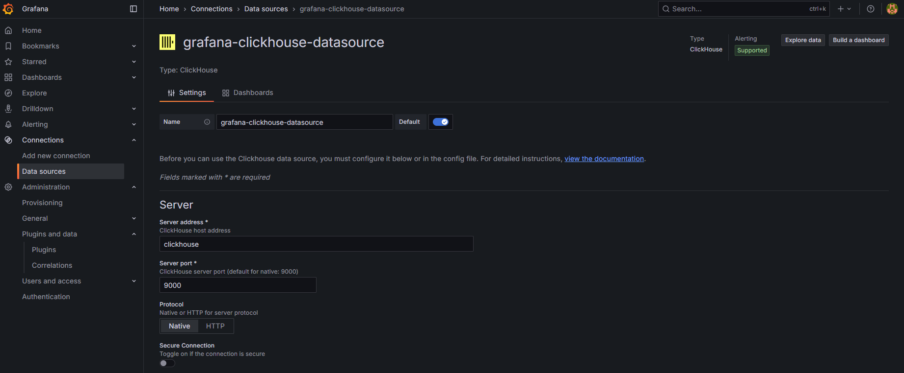

在資料分析與系統監控場景中，「資料可視化」是將資料洞察的關鍵手段。ClickHouse 雖然提供強大的查詢與聚合能力，但若要打造即時、互動式的監控面板，則需搭配可視化工具。Grafana 作為業界廣泛使用的開源監控平台，與 ClickHouse 的整合能構建靈活且具彈性的監控儀表板。

本次我們使用該 [Repository](https://github.com/viiccwen/kafka-clickhouse-data-streaming-pipeline/tree/grafana-clickhouse-dashboard) 來實作本篇文章內容。

## Grafana + ClickHouse 架構介紹

整體架構如下：

```
Kafka / Log / API → ClickHouse → Grafana
```

Grafana 作為前端查詢與呈現工具，透過 ClickHouse Plugin 連接 ClickHouse 資料庫，以 SQL 查詢方式讀取彙總後或原始資料，並即時顯示為圖表、儀表板。

## 整合步驟

> 前置作業：請先按照 [ClickHouse 系列：與 Kafka 整合打造即時 Data Streaming Pipeline](https://blog.vicwen.app/posts/clickhouse-kafka-data-streaming-pipeline/) 實作步驟，並讓 Producer 在背景執行。

### 1. 部署 Grafana 與 ClickHouse

因為 Repository 已經使用 Docker-Compose 將服務都架設好了，就只展示新增的 Grafana 服務：

```yaml
  grafana:
    image: grafana/grafana:latest
    container_name: grafana
    ports:
      - "3000:3000"
    networks:
      - kafka-network
    volumes:
      - grafana-storage:/var/lib/grafana
    environment:
      - GF_INSTALL_PLUGINS=grafana-clickhouse-datasource
    depends_on:
      - clickhouse
```

> `GF_INSTALL_PLUGINS=grafana-clickhouse-datasource` 代表已經預先安裝好了 ClickHouse Plugin。

### 2. 設定資料來源



進入 Grafana UI：

* 點選左側的「connections → Data Sources → Add data source」
* 搜尋並選擇「ClickHouse」
* 填寫連線資訊：

| 項目               | 值範例                                       |
| ---------------- | ----------------------------------------- |
| Server address              | `clickhouse`                  |
| Server port | `9000`                                 |
| Credentials             | Username: `default` / Password: `default` |

測試連線成功後儲存設定。

### 4. 建立儀表板與圖表

#### 查詢範例 1：每日事件數統計

```sql
SELECT
    toStartOfDay(EventDate) AS day,
    count() AS events
FROM user_events
GROUP BY day
ORDER BY day
```

建議搭配：

* 圖表類型：Time Series
* Time field：`day`
* Value：`events`

#### 查詢範例 2：各操作類型數量統計

```sql
SELECT
    Action,
    count(*) AS count
FROM user_events
GROUP BY Action
ORDER BY count DESC
```

建議搭配：

* 圖表類型：Bar Chart 或 Pie Chart
* 分類維度：`Action`
* 數量值：`count`

## 時間控制與資料刷新

Grafana 支援動態時間區段與自動刷新：

* 常見區段：Last 1h、6h、24h、7d...
* 自動刷新：10s、30s、1min 可調

每個面板（Panel）可自訂時間區段與刷新頻率，並支援全局時間同步。

## 建立警報條件（可選）

Grafana 可對每個查詢設定警報條件：

* 設定閾值（如：事件數 > 100）
* 通知整合：Slack、LINE、Webhook、Email...

適用於異常偵測、資源飽和警示等場景。

## 整合常見問題與排查建議

| 問題         | 解法建議                                  |
| ---------- | ------------------------------------- |
| 查無資料       | 確認 SQL 中時間欄位是否與 `$__timeFilter()` 搭配  |
| 視覺化畫面為空    | 檢查 Time field 與 Value 欄位設定            |
| 插件未載入 / 失效 | 確認版本相容性、重新啟動 Grafana、檢查 plugin 設定     |
| 效能差        | 建議結合 Materialized View 彙總後查詢，避免大表即時掃描 |

## 進階建議

| 策略                                   | 說明                                         |
| ------------------------------------ | ------------------------------------------ |
| 使用 Materialized View 預計算             | 將複雜聚合查詢預先寫入，讓 Grafana 查詢小表快速回應             |
| 加入 Kafka + Materialized View 實現即時資料流 | 整合 Kafka 寫入 ClickHouse，MV 寫入統計表，Grafana 查詢 |
| 設定 Grafana 繪圖單位（Bytes, Count, % 等）   | 提高圖表解讀性                                    |
| 使用 Panel Variables 增強互動性             | 可讓使用者動態篩選頁面、日期、使用者等維度                      |

## 總結

Grafana 是 ClickHouse 完美的可視化搭檔。藉由整合 Grafana，開發者能夠快速建構符合需求的動態 Dashboard，並搭配 ClickHouse 的高效查詢能力打造即時監控平台。

#### ClickHouse 系列持續更新中:

1. [ClickHouse 系列：ClickHouse 是什麼？與傳統 OLAP/OLTP 資料庫的差異](https://blog.vicwen.app/posts/what-is-clickhouse/)
2. [ClickHouse 系列：ClickHouse 為什麼選擇 Column-based 儲存？講解 Row-based 與 Column-based 的核心差異](https://blog.vicwen.app/posts/clickhouse-column-row-based-storage/)
3. [ClickHouse 系列：ClickHouse 儲存引擎 - MergeTree](https://blog.vicwen.app/posts/clickhouse-mergetree-engine)
4. [ClickHouse 系列：壓縮技術與 Data Skipping Indexes 如何大幅加速查詢](https://blog.vicwen.app/posts/clickhouse-compression-skipping-index/)
5. [ClickHouse 系列：ReplacingMergeTree 與資料去重機制](https://blog.vicwen.app/posts/clickhouse-replacingmergetree-deduplication/)
6. [ClickHouse 系列：SummingMergeTree 進行資料彙總的應用場景](https://blog.vicwen.app/posts/clickhouse-summingmergetree-aggregation/)
7. [ClickHouse 系列：Materialized Views 即時聚合查詢](https://blog.vicwen.app/posts/clickhouse-materialized-view/)
8. [ClickHouse 系列：分區策略與 Partition Pruning 原理解析](https://blog.vicwen.app/posts/clickhouse-partition-pruning/)
9. [ClickHouse 系列：Primary Key、Sorting Key 與 Granule 索引運作原理](https://blog.vicwen.app/posts/clickhouse-primary-sorting-key/)
10. [ClickHouse 系列：CollapsingMergeTree 與邏輯刪除的最佳實踐](https://blog.vicwen.app/posts/clickhouse-collapsingmergetree/)
11. [ClickHouse 系列：VersionedCollapsingMergeTree 版本控制與資料衝突解決](https://blog.vicwen.app/posts/clickhouse-versioned-collapsingmergetree/)
12. [ClickHouse 系列：AggregatingMergeTree 實時指標統計的進階應用](https://blog.vicwen.app/posts/clickhouse-aggregatingmergetree/)
13. [ClickHouse 系列：Distributed Table 與分布式查詢架構](https://blog.vicwen.app/posts/clickhouse-distributed-table-architecture/)
14. [ClickHouse 系列：Replicated Tables 高可用性與零停機升級實作](https://blog.vicwen.app/posts/clickhouse-replication-failover/)
15. [ClickHouse 系列：與 Kafka 整合打造即時 Data Streaming Pipeline](https://blog.vicwen.app/posts/clickhouse-kafka-data-streaming-pipeline/)
16. [ClickHouse 系列：批次匯入最佳實踐 (CSV、Parquet、Native Format)](https://blog.vicwen.app/posts/clickhouse-batch-import/)
17. [ClickHouse 系列：ClickHouse 與外部資料源整合（PostgreSQL）](https://blog.vicwen.app/posts/clickhouse-external-data-integration/)
18. [ClickHouse 系列：如何提升查詢優化？system.query_log 與 EXPLAIN 用法](https://blog.vicwen.app/posts/clickhouse-query-log-explain/)
19. [ClickHouse 系列：Projections 進階查詢加速技術](https://blog.vicwen.app/posts/clickhouse-projections-optimization/)
20. [ClickHouse 系列：Sampling 抽樣查詢與統計技術原理](https://blog.vicwen.app/posts/clickhouse-sampling-statistics/)
21. [ClickHouse 系列：TTL 資料清理與儲存成本優化](https://blog.vicwen.app/posts/clickhouse-ttl-storage-management/)
22. [ClickHouse 系列：儲存政策（Storage Policies）與磁碟資源分層策略](https://blog.vicwen.app/posts/clickhouse-storage-policies/)
23. [ClickHouse 系列：如何在 Kubernetes 部署 ClickHouse Cluster](https://blog.vicwen.app/posts/clickhouse-kubernetes-deployment/)
24. [ClickHouse 系列：ClickHouse 系列：整合 Grafana 打造可視化監控](https://blog.vicwen.app/posts/clickhouse-grafana-dashboard/) 
25. [ClickHouse 系列：APM 日誌分析平台架構實作 (Vector + ClickHouse)](https://blog.vicwen.app/posts/clickhouse-apm-log-analytics/)
26. [ClickHouse 系列：IoT 巨量感測資料平台設計實戰](https://blog.vicwen.app/posts/clickhouse-iot-analytics/)
27. [ClickHouse 系列：與 BI 工具整合（Power BI）](https://blog.vicwen.app/posts/clickhouse-bi-integration/)
28. [ClickHouse 系列：ClickHouse Cloud 與自建部署的優劣比較](https://blog.vicwen.app/posts/clickhouse-cloud-vs-self-host/)
29. [ClickHouse 系列：資料庫安全性與權限管理（RBAC）實作](https://blog.vicwen.app/posts/clickhouse-security-rbac/)