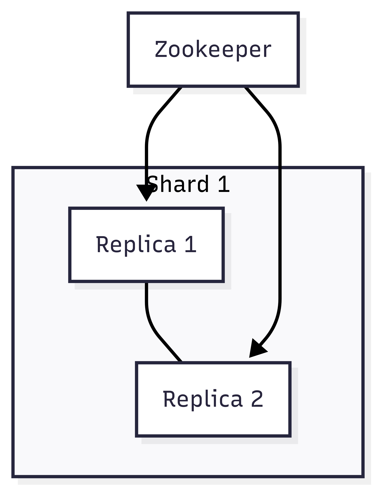

在過去 28 天，我們深入探討了 ClickHouse 的內部設計，包括 MergeTree 引擎、索引、查詢優化技巧，以及不同引擎在資料處理上的應用。這些都屬於「單機或單節點」的觀點。然而，當我們要把 ClickHouse 放到**真實的生產環境**，面對高併發、資料量成長、以及高可用性的需求時，部署策略就變得格外重要。

傳統部署方式（例如直接在 VM 或裸機上安裝）雖然簡單，但在現代雲端架構下已經不足以滿足需求。Kubernetes 作為事實上的容器編排標準，提供了自動化、可擴展、彈性化的能力，而 **ClickHouse Operator** 則讓我們能輕鬆在 Kubernetes 上管理複雜的 ClickHouse 叢集。

本篇文章會透過在單一主機上快速使用 minikube 和 clickhouse operator 模擬 Kubernates 部署分散式架構。

## 為什麼要在 Kubernetes 上部署 ClickHouse？

ClickHouse 本身的設計就非常快，但隨著資料量和使用者數成長，單一節點往往無法承受所有負載。我們需要：

* **高可用 (HA, High Availability)**
  * 節點故障時，系統能自動切換，不影響查詢。
* **水平擴展 (Horizontal Scalability)**
  * 當資料量從 100GB 成長到數 TB，甚至 PB 級，能透過擴充節點快速分擔壓力。
* **自動化維運**
  * 部署、升級、監控、滾動更新都可以透過 Kubernetes 自動化完成。
* **雲原生整合**
  * Kubernetes 的優勢在於「一切皆為 API」。監控 (Prometheus)、儲存 (PVC)、網路 (Ingress/Service) 都能與 ClickHouse 無縫結合。

ClickHouse Operator 的出現，就是為了解決這些問題。

## ClickHouse Operator 核心概念

ClickHouse Operator 是由 [Altinity](https://github.com/Altinity) 與開源社群維護的 [Kubernetes Operator](https://github.com/Altinity/clickhouse-operator)，主要目標是簡化 ClickHouse 叢集的管理。

::github{repo="Altinity/clickhouse-operator"}

它的主要功能包括：

* **Cluster CRD (Custom Resource Definition)**：允許你用 YAML 定義叢集（shards, replicas, storage, resources）。
* **自動化管理**：建立、升級、刪除、滾動更新節點。
* **高可用支援**：透過 Zookeeper 或 Keeper，支援 Replicated Tables。
* **監控整合**：自動匯出 metrics 給 Prometheus。

結構上，Operator 會監控 Kubernetes 中的 ClickHouseCluster 資源，一旦偵測到改動（例如新增一個 replica），就會自動調整底層 StatefulSet 與 Pod，確保叢集狀態與宣告式配置一致。

## 雲端部署架構設計

在雲端上，我們通常會設計一個具備以下特性的架構：

* **分片 (Shards) + 副本 (Replicas)**
  * Shard：將資料分散到不同節點，分擔儲存壓力
  * Replica：為每個 shard 建立副本，提供高可用
  * 本次實作我們使用 1 Shard, 2 Replica 架構做為測試
* **Zookeeper/Keeper 管理**
  * 協調叢集的一致性（表格複製、分片資訊）。
  * 本次實作我們使用 3 個 Zookeeper
* **Persistent Volume Claims (PVC)**
  * 保證節點重啟後資料不會丟失。
  * 本次實作我們採用 `emptyDir` (作為 Demo, 關掉後就會自動刪除資料)
* **資源配置**
  * CPU 與 Memory 限額，避免與其他工作負載競爭。

架構圖示例：



> 圖好像有點大...

這樣的設計能確保：

* 任一 Replica 宕機時，查詢不會中斷
* 當資料量變大，可以橫向擴展新的 Shard

## 實作環節

建立分散式表之前有幾項前置作業：
1. 安裝 [minikube](https://minikube.sigs.k8s.io/docs/start/?arch=%2Fwindows%2Fx86-64%2Fstable%2F.exe+download)，我是使用 wsl2 (Ubuntu 24.04.2 LTS)
    * 安裝好後可以使用 `minikube dashboard` 開啟 GUI 介面~ (Optional)
2. 安裝 [ClickHouse Operator](https://github.com/Altinity/clickhouse-operator/blob/master/docs/operator_installation_details.md)
    * 我是只有跑下面的指令就安裝好了，想知道細節可以看文件本身有講解部署了什麼元件
    ```bash
    kubectl apply -f https://raw.githubusercontent.com/Altinity/clickhouse-operator/master/deploy/operator/clickhouse-operator-install-bundle.yaml
    ``` 
3. 創建 namespace，用於隔離環境
```bash
kubectl create namespace zoo3ns
```
4. 部署三節點 Zookeeper，新增檔案如下：

```yaml
# zookeeper-3-nodes.yaml
# Setup Service to provide access to Zookeeper for clients
apiVersion: v1
kind: Service
metadata:
  # DNS would be like zookeeper.zoons
  name: zookeeper
  labels:
    app: zookeeper
spec:
  ports:
    - port: 2181
      name: client
    - port: 7000
      name: prometheus
  selector:
    app: zookeeper
    what: node
---
# Setup Headless Service for StatefulSet
apiVersion: v1
kind: Service
metadata:
  # DNS would be like zookeeper-0.zookeepers.etc
  name: zookeepers
  labels:
    app: zookeeper
spec:
  ports:
    - port: 2888
      name: server
    - port: 3888
      name: leader-election
  clusterIP: None
  selector:
    app: zookeeper
    what: node
---
# Setup max number of unavailable pods in StatefulSet
apiVersion: policy/v1
kind: PodDisruptionBudget
metadata:
  name: zookeeper-pod-disruption-budget
spec:
  selector:
    matchLabels:
      app: zookeeper
  maxUnavailable: 1
---
# Setup Zookeeper StatefulSet
# Possible params:
# 1. replicas
# 2. memory
# 3. cpu
# 4. storage
# 5. storageClassName
# 6. user to run app
apiVersion: apps/v1
kind: StatefulSet
metadata:
  # nodes would be named as zookeeper-0, zookeeper-1, zookeeper-2
  name: zookeeper
  labels:
    app: zookeeper
spec:
  selector:
    matchLabels:
      app: zookeeper
  serviceName: zookeepers
  replicas: 3
  updateStrategy:
    type: RollingUpdate
  podManagementPolicy: OrderedReady
  template:
    metadata:
      labels:
        app: zookeeper
        what: node
      annotations:
        prometheus.io/port: '7000'
        prometheus.io/scrape: 'true'
    spec:
      affinity: {}
      containers:
        - name: kubernetes-zookeeper
          imagePullPolicy: IfNotPresent
          image: "docker.io/zookeeper:3.8.4"
          resources:
            requests:
              memory: "512M"
              cpu: "1"
            limits:
              memory: "4Gi"
              cpu: "2"
          ports:
            - containerPort: 2181
              name: client
            - containerPort: 2888
              name: server
            - containerPort: 3888
              name: leader-election
            - containerPort: 7000
              name: prometheus
          env:
            - name: SERVERS
              value: "3"

# See those links for proper startup settings:
# https://github.com/kow3ns/kubernetes-zookeeper/blob/master/docker/scripts/start-zookeeper
# https://clickhouse.yandex/docs/en/operations/tips/#zookeeper
# https://github.com/ClickHouse/ClickHouse/issues/11781
          command:
            - bash
            - -x
            - -c
            - |
              HOST=`hostname -s` &&
              DOMAIN=`hostname -d` &&
              CLIENT_PORT=2181 &&
              SERVER_PORT=2888 &&
              ELECTION_PORT=3888 &&
              PROMETHEUS_PORT=7000 &&
              ZOO_DATA_DIR=/var/lib/zookeeper/data &&
              ZOO_DATA_LOG_DIR=/var/lib/zookeeper/datalog &&
              {
                echo "clientPort=${CLIENT_PORT}"
                echo 'tickTime=2000'
                echo 'initLimit=300'
                echo 'syncLimit=10'
                echo 'maxClientCnxns=2000'
                echo 'maxTimeToWaitForEpoch=2000'
                echo 'maxSessionTimeout=60000000'
                echo "dataDir=${ZOO_DATA_DIR}"
                echo "dataLogDir=${ZOO_DATA_LOG_DIR}"
                echo 'autopurge.snapRetainCount=10'
                echo 'autopurge.purgeInterval=1'
                echo 'preAllocSize=131072'
                echo 'snapCount=3000000'
                echo 'leaderServes=yes'
                echo 'standaloneEnabled=false'
                echo '4lw.commands.whitelist=*'
                echo 'metricsProvider.className=org.apache.zookeeper.metrics.prometheus.PrometheusMetricsProvider'
                echo "metricsProvider.httpPort=${PROMETHEUS_PORT}"
                echo "skipACL=true"
                echo "fastleader.maxNotificationInterval=10000"
              } > /conf/zoo.cfg &&
              {
                echo "zookeeper.root.logger=CONSOLE"
                echo "zookeeper.console.threshold=INFO"
                echo "log4j.rootLogger=\${zookeeper.root.logger}"
                echo "log4j.appender.CONSOLE=org.apache.log4j.ConsoleAppender"
                echo "log4j.appender.CONSOLE.Threshold=\${zookeeper.console.threshold}"
                echo "log4j.appender.CONSOLE.layout=org.apache.log4j.PatternLayout"
                echo "log4j.appender.CONSOLE.layout.ConversionPattern=%d{ISO8601} - %-5p [%t:%C{1}@%L] - %m%n"
              } > /conf/log4j.properties &&
              echo 'JVMFLAGS="-Xms128M -Xmx4G -XX:ActiveProcessorCount=8 -XX:+AlwaysPreTouch -Djute.maxbuffer=8388608 -XX:MaxGCPauseMillis=50"' > /conf/java.env &&
              if [[ $HOST =~ (.*)-([0-9]+)$ ]]; then
                  NAME=${BASH_REMATCH[1]} &&
                  ORD=${BASH_REMATCH[2]};
              else
                  echo "Failed to parse name and ordinal of Pod" &&
                  exit 1;
              fi &&
              mkdir -pv ${ZOO_DATA_DIR} &&
              mkdir -pv ${ZOO_DATA_LOG_DIR} &&
              whoami &&
              chown -Rv zookeeper "$ZOO_DATA_DIR" "$ZOO_DATA_LOG_DIR" &&
              export MY_ID=$((ORD+1)) &&
              echo $MY_ID > $ZOO_DATA_DIR/myid &&
              for (( i=1; i<=$SERVERS; i++ )); do
                  echo "server.$i=$NAME-$((i-1)).$DOMAIN:$SERVER_PORT:$ELECTION_PORT" >> /conf/zoo.cfg;
              done &&
              if [[ $SERVERS -eq 1 ]]; then
                  echo "group.1=1" >> /conf/zoo.cfg;
              else
                  echo "group.1=1:2:3" >> /conf/zoo.cfg;
              fi &&
              for (( i=1; i<=$SERVERS; i++ )); do
                  WEIGHT=1
                  if [[ $i == 1 ]]; then
                    WEIGHT=10
                  fi
                  echo "weight.$i=$WEIGHT" >> /conf/zoo.cfg;
              done &&
              zkServer.sh start-foreground
          readinessProbe:
            exec:
              command:
                - bash
                - -c
                - '
                  IFS=;
                  MNTR=$(exec 3<>/dev/tcp/127.0.0.1/2181 ; printf "mntr" >&3 ; tee <&3; exec 3<&- ;);
                  while [[ "$MNTR" == "This ZooKeeper instance is not currently serving requests" ]];
                  do
                    echo "wait mntr works";
                    sleep 1;
                    MNTR=$(exec 3<>/dev/tcp/127.0.0.1/2181 ; printf "mntr" >&3 ; tee <&3; exec 3<&- ;);
                  done;
                  STATE=$(echo -e $MNTR | grep zk_server_state | cut -d " " -f 2);
                  if [[ "$STATE" =~ "leader" ]]; then
                    echo "check leader state";
                    SYNCED_FOLLOWERS=$(echo -e $MNTR | grep zk_synced_followers | awk -F"[[:space:]]+" "{print \$2}" | cut -d "." -f 1);
                    if [[ "$SYNCED_FOLLOWERS" != "0" ]]; then
                      ./bin/zkCli.sh ls /;
                      exit $?;
                    else
                      exit 0;
                    fi;
                  elif [[ "$STATE" =~ "follower" ]]; then
                    echo "check follower state";
                    PEER_STATE=$(echo -e $MNTR | grep zk_peer_state);
                    if [[ "$PEER_STATE" =~ "following - broadcast" ]]; then
                      ./bin/zkCli.sh ls /;
                      exit $?;
                    else
                      exit 1;
                    fi;
                  else
                    exit 1;
                  fi
                   '
            initialDelaySeconds: 15
            periodSeconds: 10
            timeoutSeconds: 60
          livenessProbe:
            exec:
              command:
                - bash
                - -xc
                - 'date && OK=$(exec 3<>/dev/tcp/127.0.0.1/2181 ; printf "ruok" >&3 ; IFS=; tee <&3; exec 3<&- ;); if [[ "$OK" == "imok" ]]; then exit 0; else exit 1; fi'
            initialDelaySeconds: 10
            periodSeconds: 30
            timeoutSeconds: 5
          volumeMounts:
            - name: datadir-volume
              mountPath: /var/lib/zookeeper
      # Run as a non-privileged user
      securityContext:
        runAsUser: 1000
        fsGroup: 1000
      volumes:
        - name: datadir-volume
          emptyDir:
            medium: "" #accepted values:  empty str (means node's default medium) or Memory
            sizeLimit: 1Gi
```
    
接著 apply 該部署文件和確認 zookeeper 是否都已建立：
    
```bash
# 部署配置
kubectl apply -f zookeeper-3-nodes.yaml -n zoo3ns

# 確認 service
kubectl get svc -n zoo3ns
NAME        TYPE        CLUSTER-IP          EXTERNAL-IP   PORT(S)            AGE
zookeeper   ClusterIP   {YOUR-CLUSTER-IP}   <none>        2181/TCP,7000/TCP  54m
zookeepers  ClusterIP   None                <none>        2888/TCP,3888/TCP  54m

# 確認 pods
kubectl get pod -n zoo3ns
NAME            READY   STATUS    RESTARTS   AGE
zookeeper-0     1/1     Running   0          53m
zookeeper-1     1/1     Running   0          53m
zookeeper-2     1/1     Running   0          52m
```

5. 部署 Clickhouse with 1 shards and 2 replicas
```yaml
# clickhouse-1shards-2replicas.yaml
apiVersion: "clickhouse.altinity.com/v1"
kind: "ClickHouseInstallation"

metadata:
  name: "repl-05"

spec:
  defaults:
    templates:
      dataVolumeClaimTemplate: default
      podTemplate: clickhouse-20.7

  configuration:
    zookeeper:
      nodes:
      - host: zookeeper.zoo3ns
    clusters:
      - name: replicated
        layout:
          shardsCount: 1
          replicasCount: 2

  templates:
    volumeClaimTemplates:
      - name: default
        spec:
          accessModes:
            - ReadWriteOnce
          resources:
            requests:
              storage: 500Mi
    podTemplates:
      - name: clickhouse-20.7
        spec:
          containers:
            - name: clickhouse-pod
              image: clickhouse/clickhouse-server:24.8
```

接著 apply 該部署文件和確認 zookeeper 是否都已建立：
```bash
# 部署配置
kubectl apply -f clickhouse-1shards-2replicas.yaml -n zoo3ns

# 確認 service
kubectl get svc -n zoo3ns
NAME                         TYPE        CLUSTER-IP      EXTERNAL-IP   PORT(S)                      AGE
chi-repl-05-replicated-0-0   ClusterIP   None            <none>        9000/TCP,8123/TCP,9009/TCP   50m
chi-repl-05-replicated-0-1   ClusterIP   None            <none>        9000/TCP,8123/TCP,9009/TCP   49m
clickhouse-repl-05           ClusterIP   None            <none>        8123/TCP,9000/TCP            49m

# 確認 pods
kubectl get pod -n zoo3ns
NAME                           READY   STATUS    RESTARTS   AGE
chi-repl-05-replicated-0-0-0   1/1     Running   0          50m
chi-repl-05-replicated-0-1-0   1/1     Running   0          50m
```

如果都完成了，恭喜你完成最難的一步🚀：**建置環境**

6. 進入 ClickHouse 內部測試是否成功
    * 開啟兩個 terminal，個別進入不同的 pods
        ```bash
        kubectl exec -it chi-repl-05-replicated-0-0-0 -- bash
        kubectl exec -it chi-repl-05-replicated-0-1-0 -- bash
        ```
    * 進入後輸入 `clickhouse-client`
    * 在 `chi-repl-05-replicated-0-0-0` pod 內部建立 `ReplicatedMergeTree`，這個 MergeTree 引擎可以幫助你自動同步不同 cluster, shards, replicas... 的資料

    ```sql
    CREATE TABLE events_local ON CLUSTER `{cluster}`
    (
        `event_date` Date,
        `event_type` Int32,
        `article_id` Int32,
        `title` String
    )
    ENGINE = ReplicatedMergeTree('/clickhouse/{installation}/{cluster}/tables/{shard}/{database}/{table}', '{replica}')
    PARTITION BY toYYYYMM(event_date)
    ORDER BY (event_type, article_id)
    ```
    得到結果，代表你已經成功新增了。
    ```sql
    Query id: 0e9d3beb-59ea-4194-9dbe-9f7cf88e19cc

    ┌─host───────────────────────┬─port─┬─status─┬─error─┬─num_hosts_remaining─┬─num_hosts_active─┐
    1. │ chi-repl-05-replicated-0-0 │ 9000 │      0 │       │                   1 │                0 │
    2. │ chi-repl-05-replicated-0-1 │ 9000 │      0 │       │                   0 │                0 │
    └────────────────────────────┴──────┴────────┴───────┴─────────────────────┴──────────────────┘

    2 rows in set. Elapsed: 0.253 sec.
    ```
    * 接著建立本地表

    ```sql
    CREATE TABLE events ON CLUSTER `{cluster}` AS events_local
    ENGINE = Distributed('{cluster}', default, events_local, rand())
    ```

    得到結果，代表你已經成功新增了。

    ```sql
    Query id: b203ec4b-08b1-45bf-98ea-6d4ad32956d8

    ┌─host───────────────────────┬─port─┬─status─┬─error─┬─num_hosts_remaining─┬─num_hosts_active─┐
    1. │ chi-repl-05-replicated-0-0 │ 9000 │      0 │       │                   1 │                0 │
    2. │ chi-repl-05-replicated-0-1 │ 9000 │      0 │       │                   0 │                0 │
    └────────────────────────────┴──────┴────────┴───────┴─────────────────────┴──────────────────┘

    2 rows in set. Elapsed: 0.084 sec.
    ```

    * 接著可以在 `chi-repl-05-replicated-0-0-0` 插入資料，在 `chi-repl-05-replicated-0-1-0` 觀察資料是否有同步
        * 先在 `chi-repl-05-replicated-0-1-0` 觀察，沒有資料是正常的:
        ```sql
        SELECT *
        FROM events_local
        WHERE event_type = 100

        Query id: 4dd7fbbd-4089-4b7a-aa16-af78baeaf3f4

        Ok.

        0 rows in set. Elapsed: 0.002 sec.
        ```
        * 在 `chi-repl-05-replicated-0-0-0` 插入資料
        ```sql
        INSERT INTO events VALUES (today(), 100, 123, 'from pod A');
        ```
        * 回到 `chi-repl-05-replicated-0-1-0` 觀察:
        ```sql
        SELECT *
        FROM events_local
        WHERE event_type = 100

        Query id: 1537f542-a13d-4a19-b29b-baed69b476c8

        ┌─event_date─┬─event_type─┬─article_id─┬─title──────┐
        1. │ 2025-08-28 │        100 │        123 │ from pod A │
        └────────────┴────────────┴────────────┴────────────┘

        1 row in set. Elapsed: 0.002 sec.
        ```

到這邊都是正確的，代表你成功了！！！（但是是在單節點上）

## 部署過程中的挑戰與解決方案

即便有了 Operator，仍然會遇到一些挑戰：

* **儲存管理**
  * PVC 大小需事先規劃，否則後期調整麻煩。
  * 解法：使用 StorageClass 提供動態擴展。

* **升級策略**
  * 直接升級可能導致節點不一致。
  * 解法：使用 Rolling Update，並確保表格引擎為 Replicated 系列。

* **監控與觀測性**
  * 查詢效能下降時需要快速診斷。
  * 解法：結合 Prometheus + Grafana，監控 query latency、merge 數量、磁碟使用率。

* **網路與流量分配**
  * 多 Shard 查詢需透過 Distributed Table 或外部負載平衡。
  * 解法：Kubernetes Ingress + ClickHouse Distributed Engine。

## 與傳統 VM 部署的差異

| 面向   | VM/裸機部署         | Kubernetes 部署         |
| ---- | --------------- | --------------------- |
| 部署方式 | 手動安裝、配置         | YAML 定義、自動化           |
| 擴容   | 需人工加機器、改設定      | 修改 replicas/shards 即可 |
| 高可用  | 需人工維護 Zookeeper | Operator 自動協調         |
| 升級   | 容易停機            | 滾動更新、零停機              |
| 監控   | 額外安裝            | Prometheus/Grafana 整合 |

結論很明顯：如果你是單機測試，VM 部署即可；但若要進入生產環境，Kubernetes + Operator 幾乎是標準解。

## 結語

ClickHouse 本身非常強大，但若缺乏好的部署方式，容易因節點故障、擴展困難、升級不便而影響穩定性。Kubernetes 與 ClickHouse Operator 的結合，讓我們能：

* 以 **宣告式配置 (YAML)** 管理整個叢集
* 自動化完成 **部署、升級、擴展**
* 提供高可用與容錯能力，支援雲端規模的數據分析

在資料量不斷成長的今天，這種雲原生部署方式已成為 ClickHouse 生產環境的首選。

明天就是 ClickHouse 系列最後一天了：Ｄ


### ClickHouse 系列持續更新中:

1. [ClickHouse 系列：ClickHouse 是什麼？與傳統 OLAP/OLTP 資料庫的差異](https://blog.vicwen.app/posts/what-is-clickhouse/)
2. [ClickHouse 系列：ClickHouse 為什麼選擇 Column-based 儲存？講解 Row-based 與 Column-based 的核心差異](https://blog.vicwen.app/posts/clickhouse-column-row-based-storage/)
3. [ClickHouse 系列：ClickHouse 儲存引擎 - MergeTree](https://blog.vicwen.app/posts/clickhouse-mergetree-engine)
4. [ClickHouse 系列：壓縮技術與 Data Skipping Indexes 如何大幅加速查詢](https://blog.vicwen.app/posts/clickhouse-compression-skipping-index/)
5. [ClickHouse 系列：ReplacingMergeTree 與資料去重機制](https://blog.vicwen.app/posts/clickhouse-replacingmergetree-deduplication/)
6. [ClickHouse 系列：SummingMergeTree 進行資料彙總的應用場景](https://blog.vicwen.app/posts/clickhouse-summingmergetree-aggregation/)
7. [ClickHouse 系列：Materialized Views 即時聚合查詢](https://blog.vicwen.app/posts/clickhouse-materialized-view/)
8. [ClickHouse 系列：分區策略與 Partition Pruning 原理解析](https://blog.vicwen.app/posts/clickhouse-partition-pruning/)
9. [ClickHouse 系列：Primary Key、Sorting Key 與 Granule 索引運作原理](https://blog.vicwen.app/posts/clickhouse-primary-sorting-key/)
10. [ClickHouse 系列：CollapsingMergeTree 與邏輯刪除的最佳實踐](https://blog.vicwen.app/posts/clickhouse-collapsingmergetree/)
11. [ClickHouse 系列：VersionedCollapsingMergeTree 版本控制與資料衝突解決](https://blog.vicwen.app/posts/clickhouse-versioned-collapsingmergetree/)
12. [ClickHouse 系列：AggregatingMergeTree 實時指標統計的進階應用](https://blog.vicwen.app/posts/clickhouse-aggregatingmergetree/)
13. [ClickHouse 系列：Distributed Table 與分布式查詢架構](https://blog.vicwen.app/posts/clickhouse-distributed-table-architecture/)
14. [ClickHouse 系列：Replicated Tables 高可用性與零停機升級實作](https://blog.vicwen.app/posts/clickhouse-replication-failover/)
15. [ClickHouse 系列：與 Kafka 整合打造即時 Data Streaming Pipeline](https://blog.vicwen.app/posts/clickhouse-kafka-data-streaming-pipeline/)
16. [ClickHouse 系列：批次匯入最佳實踐 (CSV、Parquet、Native Format)](https://blog.vicwen.app/posts/clickhouse-batch-import/)
17. [ClickHouse 系列：ClickHouse 與外部資料源整合（PostgreSQL）](https://blog.vicwen.app/posts/clickhouse-external-data-integration/)
18. [ClickHouse 系列：如何提升查詢優化？system.query_log 與 EXPLAIN 用法](https://blog.vicwen.app/posts/clickhouse-query-log-explain/)
19. [ClickHouse 系列：Projections 進階查詢加速技術](https://blog.vicwen.app/posts/clickhouse-projections-optimization/)
20. [ClickHouse 系列：Sampling 抽樣查詢與統計技術原理](https://blog.vicwen.app/posts/clickhouse-sampling-statistics/)
21. [ClickHouse 系列：TTL 資料清理與儲存成本優化](https://blog.vicwen.app/posts/clickhouse-ttl-storage-management/)
22. [ClickHouse 系列：儲存政策（Storage Policies）與磁碟資源分層策略](https://blog.vicwen.app/posts/clickhouse-storage-policies/)
23. [ClickHouse 系列：表格設計與儲存優化細節](https://blog.vicwen.app/posts/clickhouse-schemas-storage-improvement/)
24. [ClickHouse 系列：ClickHouse 系列：整合 Grafana 打造可視化監控](https://blog.vicwen.app/posts/clickhouse-grafana-dashboard/)
25. [ClickHouse 系列：查詢優化案例](https://blog.vicwen.app/posts/clickhouse-select-optimization/)
26. [ClickHouse 系列：與 BI 工具整合（Power BI）](https://blog.vicwen.app/posts/clickhouse-bi-integration/)
27. [ClickHouse 系列：ClickHouse Cloud 與自建部署的優劣比較](https://blog.vicwen.app/posts/clickhouse-cloud-vs-self-host/)
28. [ClickHouse 系列：資料庫安全性與權限管理（RBAC）實作](https://blog.vicwen.app/posts/clickhouse-security-rbac/)
29. [ClickHouse 系列：Kubernetes 部署分散式架構](https://blog.vicwen.app/posts/clickhouse-operator-kubernates/)
30. [ClickHouse 系列：從原始碼看 MergeTree 的六大核心機制](https://blog.vicwen.app/posts/clickhouse-mergetree-sourcecode-introduction/)