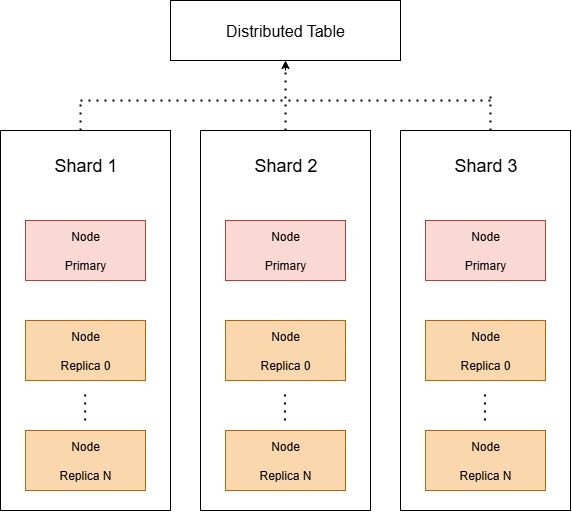

:::warning
This article covers some basic definitions and concepts from distributed systems, so feel free to enjoy it.
:::

As data volume grows from the TB level to the PB level, a single-node architecture is obviously no longer enough for modern analytics and real-time query workloads. Through **Distributed Tables and distributed query architecture**, ClickHouse can scale horizontally across **dozens or even hundreds of nodes** while still keeping query latency at the second level on massive datasets.

## What Is a Distributed Table?

A Distributed Table is not a table that **actually stores data**. Instead, it is ClickHouse's **query-routing proxy**. Its job is to:

* Receive distributed query requests.
* Route queries to the correct data nodes based on the sharding rule.
* Collect results from each shard and merge them before returning them to the user.

### Core Concepts:

| Name                | Description                                                         |
| ------------------- | ------------------------------------------------------------------- |
| Shard               | The horizontal unit of data partitioning. Each shard stores a subset of the data. |
| Replica             | Multiple copies of the same shard, used for high availability and read load balancing. |
| Distributed Table   | The router that dispatches queries to the correct Shard/Replica nodes. |
| Remote Table        | The table that actually stores data, usually MergeTree or one of its variants. |



> Made it myself

## Syntax and Configuration

### 1. Create the Remote Table (The Table That Actually Stores Data)

```sql
CREATE TABLE cluster_shard.local_visits
(
    Date Date,
    UserID UInt64,
    PageViews UInt32
) ENGINE = MergeTree()
ORDER BY (Date, UserID);
```

### 2. Create the Distributed Table (The Distributed Query Routing Table)

:::warning
In ClickHouse Cloud, if you want to create a distributed table, **`Distributed(...)` is not supported**. Use [remote/remoteSecure](https://clickhouse.com/docs/sql-reference/table-functions/remote) instead.
:::

```sql
CREATE TABLE [IF NOT EXISTS] [db.]table_name [ON CLUSTER cluster] AS [db2.]name2 ENGINE = Distributed(cluster, database, table[, sharding_key[, policy_name]]) [SETTINGS name=value, ...]
```

```sql
CREATE TABLE cluster_shard.distributed_visits
AS cluster_shard.local_visits
ENGINE = Distributed(cluster_name, 'cluster_shard', local_visits, rand());
```

### Parameter Explanation:

| Parameter         | Description                                                           |
| ----------------- | --------------------------------------------------------------------- |
| `cluster_name`    | The cluster name defined in `clusters.xml`.                           |
| `cluster_shard`   | The database name.                                                    |
| `local_visits`    | The Remote Table name, meaning the actual target data table.          |
| `rand()`          | The shard selection strategy. Another common option is `sharding_key()` for finer control. |

### Sharding Strategy Design

| Strategy                       | Description                                                                 |
| ----------------------------- | --------------------------------------------------------------------------- |
| `rand()`                      | Random sharding, suitable when there is no clear partitioning rule but write load should stay balanced |
| `cityHash64(UserID) % N`      | Hash by `UserID`, ensuring the same user's data lands on the same shard     |
| `toYYYYMM(Date) % N`          | Partition by time, suitable for time-series data such as logs or sensor data |
| Sharding Expression (any column) | Freely define composite shard keys to optimize query pruning based on business logic |

#### Design Recommendations:

* Keep the shard count and data volume balanced to avoid skew.
* Choose a sharding key that aligns as closely as possible with your **query `WHERE` conditions** to improve data skipping.
* Avoid queries that scan all shards whenever possible.

## Shard and Replica Architecture

| Component                       | Description                                                                 |
| ------------------------------ | --------------------------------------------------------------------------- |
| Shard                          | The horizontal data partitioning unit. Data exists only on the replicas inside that shard. |
| Replica                        | Multiple copies of the same shard, storing identical data for HA and read balancing |
| ZooKeeper / ClickHouse Keeper  | Coordinates replica synchronization and cluster behavior such as failover    |

## How Distributed Queries Work

1. **The client sends a query to the Distributed Table**.
2. The Distributed Table determines which shards to use based on the sharding key or `rand()`.
3. In each shard, ClickHouse automatically chooses a Replica Node based on load, or reads from any available replica.
4. Each node executes its part of the query and returns partial results to the Distributed Table node.
5. The Distributed Table node merges the shard results and returns the final answer to the client.

## Replica Design Strategies

| Strategy                  | Description                                                                 |
| ------------------------- | --------------------------------------------------------------------------- |
| High availability         | If the primary node fails, traffic can switch automatically to another replica and queries continue |
| Read load balancing       | Spread read traffic across different replicas to reduce single-node pressure |
| Write consistency (Quorum Writes) | For important data, quorum can be enabled so a write succeeds only after confirmation from multiple replicas |

## Optimization Directions

| Optimization Area                               | Description                                                                 |
| ----------------------------------------------- | --------------------------------------------------------------------------- |
| Query pruning (Data Skipping)                   | Design good Partition Keys and Sharding Keys to avoid full scans            |
| All-replicas option tuning                      | Control whether queries read all replicas or just one, to avoid unnecessary replica pressure |
| `distributed_aggregation_memory_efficient`      | Enable memory-efficient distributed aggregation so results are merged in batches and use less memory |
| Configure a preferred replica strategy          | Let certain nodes respond first to reduce cache misses caused by fully random reads |

## Additional Notes

There is a lot more here. If you are interested, check the [official documentation](https://clickhouse.com/docs/engines/table-engines/special/distributed). Below are a few extra points:

### 1. INSERT, SELECT

| Operation | Behavior                                                                 |
| --------- | ------------------------------------------------------------------------ |
| INSERT    | Data is written to the target shard according to the sharding key. If `internal_replication=true`, it is written to only one replica first, and the others catch up through replication. |
| SELECT    | The Distributed Table queries all matching shards in parallel and merges results. If the query condition includes the sharding key, only the relevant shard may be touched. |

### 2. **Prefer local reads in Distributed Tables (`prefer_localhost_replica`)**

* If the Distributed Table node is also one of the Replica nodes in `remote_servers`, reads prefer the local node by default to reduce network traffic.
* This behavior is controlled by **`prefer_localhost_replica`**, which can force or disable that preference.

### 3. **Data Skipping with Distributed Tables**

* If the Remote Tables behind a Distributed Table, such as MergeTree tables, are designed with Partition / Primary Key indexes, ClickHouse can still use those indexes for data skipping in distributed queries.
* The condition is that the query predicates need to align with the shard key or partition condition. Otherwise, all shards will still be scanned.


### 4. **`insert_distributed_sync` Setting (Force Synchronous Writes)**

* By default, `INSERT` into a Distributed Table is asynchronous. Once data is forwarded to the remote shard, the insert is considered successful.
* If you want the insert to wait until all shards respond before returning success, set `insert_distributed_sync = 1`.
* This increases write latency, but ensures the write has completed across all nodes before success is returned.

### 5. **Supports Distributed DDL (`ON CLUSTER`)**

* If `allow_distributed_ddl_queries = true` is configured in `clusters.xml`, you can use:

  ```sql
  CREATE TABLE my_table ON CLUSTER my_cluster ...
  ```

  to automatically synchronize the table definition across all nodes in the cluster.
* This is useful when you need consistent schema across nodes for Distributed Tables.

### 6. **`distributed_aggregation_memory_efficient`**

* During distributed `GROUP BY`, extremely large datasets can cause high memory pressure.
* With `distributed_aggregation_memory_efficient = 1`, ClickHouse lets each shard return partial aggregation results first, then merges them in batches to reduce memory pressure on the driver node.

| Feature                                   | Description                                                                 |
| ----------------------------------------- | --------------------------------------------------------------------------- |
| `distributed_product_mode`                | Controls join behavior between Distributed tables, such as `All`, `Deny`, or `Local` |
| `prefer_localhost_replica`                | Controls whether Distributed Table queries prefer reading from the local replica |
| `connect_timeout_with_failover_ms`        | Timeout for switching to another replica if one fails during a Distributed query |


### More ClickHouse Series Posts Coming:

1. [ClickHouse Series: What Is ClickHouse? Differences from Traditional OLAP/OLTP Databases](https://blog.vicwen.app/posts/what-is-clickhouse/)
2. [ClickHouse Series: Why ClickHouse Uses Column-Based Storage? A Core Comparison of Row-Based and Column-Based Storage](https://blog.vicwen.app/posts/clickhouse-column-row-based-storage/)
3. [ClickHouse Series: ClickHouse Storage Engine - MergeTree](https://blog.vicwen.app/posts/clickhouse-mergetree-engine)
4. [ClickHouse Series: How Compression and Data Skipping Indexes Greatly Speed Up Queries](https://blog.vicwen.app/posts/clickhouse-compression-skipping-index/)
5. [ClickHouse Series: ReplacingMergeTree and the Data Deduplication Mechanism](https://blog.vicwen.app/posts/clickhouse-replacingmergetree-deduplication/)
6. [ClickHouse Series: Use Cases for Data Aggregation with SummingMergeTree](https://blog.vicwen.app/posts/clickhouse-summingmergetree-aggregation/)
7. [ClickHouse Series: Real-Time Aggregation Queries with Materialized Views](https://blog.vicwen.app/posts/clickhouse-materialized-view/)
8. [ClickHouse Series: Partition Strategy and Partition Pruning Explained](https://blog.vicwen.app/posts/clickhouse-partition-pruning/)
9. [ClickHouse Series: How Primary Key, Sorting Key, and Granule Indexes Work](https://blog.vicwen.app/posts/clickhouse-primary-sorting-key/)
10. [ClickHouse Series: Best Practices for CollapsingMergeTree and Soft Deletes](https://blog.vicwen.app/posts/clickhouse-collapsingmergetree/)
11. [ClickHouse Series: VersionedCollapsingMergeTree for Version Control and Conflict Resolution](https://blog.vicwen.app/posts/clickhouse-versioned-collapsingmergetree/)
12. [ClickHouse Series: Advanced Real-Time Metrics with AggregatingMergeTree](https://blog.vicwen.app/posts/clickhouse-aggregatingmergetree/)
13. [ClickHouse Series: Distributed Tables and Distributed Query Architecture](https://blog.vicwen.app/posts/clickhouse-distributed-table-architecture/)
14. [ClickHouse Series: Replicated Tables for High Availability and Zero-Downtime Upgrades](https://blog.vicwen.app/posts/clickhouse-replication-failover/)
15. [ClickHouse Series: Building a Real-Time Data Streaming Pipeline with Kafka](https://blog.vicwen.app/posts/clickhouse-kafka-data-streaming-pipeline/)
16. [ClickHouse Series: Best Practices for Batch Import (CSV, Parquet, Native Format)](https://blog.vicwen.app/posts/clickhouse-batch-import/)
17. [ClickHouse Series: Integrating ClickHouse with External Data Sources (PostgreSQL)](https://blog.vicwen.app/posts/clickhouse-external-data-integration/)
18. [ClickHouse Series: How to Improve Query Performance with system.query_log and EXPLAIN](https://blog.vicwen.app/posts/clickhouse-query-log-explain/)
19. [ClickHouse Series: Advanced Query Acceleration with Projections](https://blog.vicwen.app/posts/clickhouse-projections-optimization/)
20. [ClickHouse Series: Sampling Queries and the Principles Behind Statistical Techniques](https://blog.vicwen.app/posts/clickhouse-sampling-statistics/)
21. [ClickHouse Series: TTL Data Cleanup and Storage Cost Optimization](https://blog.vicwen.app/posts/clickhouse-ttl-storage-management/)
22. [ClickHouse Series: Storage Policies and Disk Tiering Strategy](https://blog.vicwen.app/posts/clickhouse-storage-policies/)
23. [ClickHouse Series: Table Design and Storage Optimization Details](https://blog.vicwen.app/posts/clickhouse-schemas-storage-improvement/)
24. [ClickHouse Series: Building Visual Monitoring with Grafana](https://blog.vicwen.app/posts/clickhouse-grafana-dashboard/)
25. [ClickHouse Series: Query Optimization Case Studies](https://blog.vicwen.app/posts/clickhouse-select-optimization/)
26. [ClickHouse Series: Integrating with BI Tools (Power BI)](https://blog.vicwen.app/posts/clickhouse-bi-integration/)
27. [ClickHouse Series: Comparing ClickHouse Cloud and Self-Hosted Deployments](https://blog.vicwen.app/posts/clickhouse-cloud-vs-self-host/)
28. [ClickHouse Series: Database Security and RBAC Implementation](https://blog.vicwen.app/posts/clickhouse-security-rbac/)
29. [ClickHouse Series: Deploying a Distributed Architecture on Kubernetes](https://blog.vicwen.app/posts/clickhouse-operator-kubernates/)
30. [ClickHouse Series: Six Core MergeTree Mechanisms Through the Source Code](https://blog.vicwen.app/posts/clickhouse-mergetree-sourcecode-introduction/)
