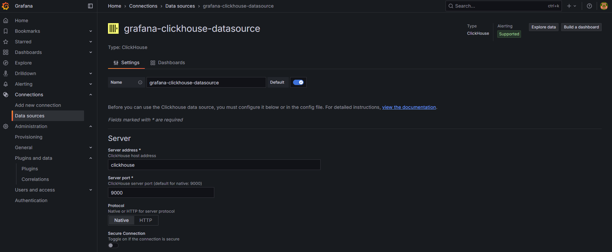

In data analytics and system monitoring scenarios, data visualization is one of the key ways to turn data into insight. Although ClickHouse provides powerful query and aggregation capabilities, you still need a visualization tool if you want to build real-time, interactive monitoring panels. Grafana, a widely used open-source monitoring platform, integrates naturally with ClickHouse and makes it possible to build flexible dashboards.

For this article, we use this [repository](https://github.com/viiccwen/kafka-clickhouse-data-streaming-pipeline/tree/grafana-clickhouse-dashboard) for the implementation.

## Grafana + ClickHouse Architecture Overview

The overall architecture looks like this:

```
Kafka / Log / API → ClickHouse → Grafana
```

Grafana acts as the frontend query and visualization layer. It connects to the ClickHouse database through the ClickHouse Plugin, queries either aggregated or raw data with SQL, and renders the results in real time as charts and dashboards.

## Integration Steps

> Prerequisite: please first follow the implementation steps in [ClickHouse Series: Building a Real-Time Data Streaming Pipeline with Kafka Integration](https://blog.vicwen.app/posts/clickhouse-kafka-data-streaming-pipeline/) and keep the Producer running in the background.

### 1. Deploy Grafana and ClickHouse

Because the repository already sets up the services with Docker Compose, here we only show the newly added Grafana service:

```yaml
  grafana:
    image: grafana/grafana:latest
    container_name: grafana
    ports:
      - "3000:3000"
    networks:
      - kafka-network
    volumes:
      - grafana-storage:/var/lib/grafana
    environment:
      - GF_INSTALL_PLUGINS=grafana-clickhouse-datasource
    depends_on:
      - clickhouse
```

> `GF_INSTALL_PLUGINS=grafana-clickhouse-datasource` means the ClickHouse Plugin is preinstalled.

### 2. Configure the Data Source



In the Grafana UI:

* Click `connections → Data Sources → Add data source` in the left sidebar
* Search for and select `ClickHouse`
* Fill in the connection information:

| Item | Example value |
| ---- | ------------- |
| Server address | `clickhouse` |
| Server port | `9000` |
| Credentials | Username: `default` / Password: `default` |

After the connection test succeeds, save the settings.

### 4. Create Dashboards and Charts

#### Query Example 1: Daily event count statistics

```sql
SELECT
    toStartOfDay(EventDate) AS day,
    count() AS events
FROM user_events
GROUP BY day
ORDER BY day
```

Recommended setup:

* Chart type: Time Series
* Time field: `day`
* Value: `events`

#### Query Example 2: Counts by action type

```sql
SELECT
    Action,
    count(*) AS count
FROM user_events
GROUP BY Action
ORDER BY count DESC
```

Recommended setup:

* Chart type: Bar Chart or Pie Chart
* Category dimension: `Action`
* Value: `count`

## Time Controls and Data Refresh

Grafana supports dynamic time ranges and auto-refresh:

* Common ranges: Last 1h, 6h, 24h, 7d...
* Auto-refresh: adjustable to 10s, 30s, 1min

Each panel can define its own time range and refresh interval, and global time synchronization is also supported.

## Create Alert Conditions (Optional)

Grafana can configure alert conditions for each query:

* Set a threshold (for example: event count > 100)
* Notification integrations: Slack, LINE, Webhook, Email...

This is suitable for scenarios such as anomaly detection and resource saturation alerts.

## Common Integration Issues and Troubleshooting Suggestions

| Problem | Suggested fix |
| ------- | ------------- |
| No data found | Check whether the time column in your SQL works with `$__timeFilter()` |
| Empty visualization | Check the Time field and Value field settings |
| Plugin not loaded / not working | Check version compatibility, restart Grafana, and inspect plugin settings |
| Poor performance | It is recommended to query Materialized View summary tables instead of scanning large tables in real time |

## Advanced Suggestions

| Strategy | Description |
| -------- | ----------- |
| Use Materialized View precomputation | Prewrite complex aggregations so Grafana can query smaller tables quickly |
| Combine Kafka + Materialized View for real-time streams | Use Kafka to write into ClickHouse, let MV write into aggregate tables, and let Grafana query those tables |
| Configure Grafana display units (Bytes, Count, %, etc.) | Improves readability of charts |
| Use Panel Variables for better interactivity | Allows users to dynamically filter by page, date, user, and other dimensions |

## Closing Thoughts

Grafana is an excellent visualization companion for ClickHouse. By integrating Grafana, developers can quickly build dynamic dashboards that fit their needs and, together with ClickHouse's high-performance query engine, create real-time monitoring platforms.

### ClickHouse Series Updates:

1. [ClickHouse Series: What Is ClickHouse? How It Differs from Traditional OLAP/OLTP Databases](https://blog.vicwen.app/posts/what-is-clickhouse/)
2. [ClickHouse Series: Why Does ClickHouse Choose Column-based Storage? The Core Differences Between Row-based and Column-based Storage](https://blog.vicwen.app/posts/clickhouse-column-row-based-storage/)
3. [ClickHouse Series: ClickHouse Storage Engine - MergeTree](https://blog.vicwen.app/posts/clickhouse-mergetree-engine)
4. [ClickHouse Series: How Compression and Data Skipping Indexes Greatly Speed Up Queries](https://blog.vicwen.app/posts/clickhouse-compression-skipping-index/)
5. [ClickHouse Series: ReplacingMergeTree and Data Deduplication](https://blog.vicwen.app/posts/clickhouse-replacingmergetree-deduplication/)
6. [ClickHouse Series: SummingMergeTree for Data Aggregation Use Cases](https://blog.vicwen.app/posts/clickhouse-summingmergetree-aggregation/)
7. [ClickHouse Series: Materialized Views for Real-Time Aggregation Queries](https://blog.vicwen.app/posts/clickhouse-materialized-view/)
8. [ClickHouse Series: Partitioning Strategy and Partition Pruning Explained](https://blog.vicwen.app/posts/clickhouse-partition-pruning/)
9. [ClickHouse Series: How Primary Key, Sorting Key, and Granule Indexes Work](https://blog.vicwen.app/posts/clickhouse-primary-sorting-key/)
10. [ClickHouse Series: CollapsingMergeTree and Best Practices for Logical Deletion](https://blog.vicwen.app/posts/clickhouse-collapsingmergetree/)
11. [ClickHouse Series: VersionedCollapsingMergeTree for Version Control and Conflict Resolution](https://blog.vicwen.app/posts/clickhouse-versioned-collapsingmergetree/)
12. [ClickHouse Series: Advanced Uses of AggregatingMergeTree for Real-Time Metrics](https://blog.vicwen.app/posts/clickhouse-aggregatingmergetree/)
13. [ClickHouse Series: Distributed Tables and Distributed Query Architecture](https://blog.vicwen.app/posts/clickhouse-distributed-table-architecture/)
14. [ClickHouse Series: High Availability and Zero-Downtime Upgrades with Replicated Tables](https://blog.vicwen.app/posts/clickhouse-replication-failover/)
15. [ClickHouse Series: Building a Real-Time Data Streaming Pipeline with Kafka Integration](https://blog.vicwen.app/posts/clickhouse-kafka-data-streaming-pipeline/)
16. [ClickHouse Series: Best Practices for Batch Imports (CSV, Parquet, Native Format)](https://blog.vicwen.app/posts/clickhouse-batch-import/)
17. [ClickHouse Series: Integrating ClickHouse with External Data Sources (PostgreSQL)](https://blog.vicwen.app/posts/clickhouse-external-data-integration/)
18. [ClickHouse Series: How to Improve Query Performance with system.query_log and EXPLAIN](https://blog.vicwen.app/posts/clickhouse-query-log-explain/)
19. [ClickHouse Series: Advanced Query Acceleration with Projections](https://blog.vicwen.app/posts/clickhouse-projections-optimization/)
20. [ClickHouse Series: Sampling Queries and Statistical Techniques](https://blog.vicwen.app/posts/clickhouse-sampling-statistics/)
21. [ClickHouse Series: TTL Data Cleanup and Storage Cost Optimization](https://blog.vicwen.app/posts/clickhouse-ttl-storage-management/)
22. [ClickHouse Series: Storage Policies and Tiered Disk Strategy](https://blog.vicwen.app/posts/clickhouse-storage-policies/)
23. [ClickHouse Series: Table Design and Storage Optimization Details](https://blog.vicwen.app/posts/clickhouse-schemas-storage-improvement/)
24. [ClickHouse Series: Building Visual Monitoring with Grafana Integration](https://blog.vicwen.app/posts/clickhouse-grafana-dashboard/)
25. [ClickHouse Series: Query Optimization Case Studies](https://blog.vicwen.app/posts/clickhouse-select-optimization/)
26. [ClickHouse Series: Integrating with BI Tools (Power BI)](https://blog.vicwen.app/posts/clickhouse-bi-integration/)
27. [ClickHouse Series: ClickHouse Cloud vs. Self-Hosted Deployments](https://blog.vicwen.app/posts/clickhouse-cloud-vs-self-host/)
28. [ClickHouse Series: Implementing Database Security and RBAC](https://blog.vicwen.app/posts/clickhouse-security-rbac/)
29. [ClickHouse Series: Deploying a Distributed Architecture on Kubernetes](https://blog.vicwen.app/posts/clickhouse-operator-kubernates/)
30. [ClickHouse Series: The Six Core Mechanisms of MergeTree from the Source Code](https://blog.vicwen.app/posts/clickhouse-mergetree-sourcecode-introduction/)
