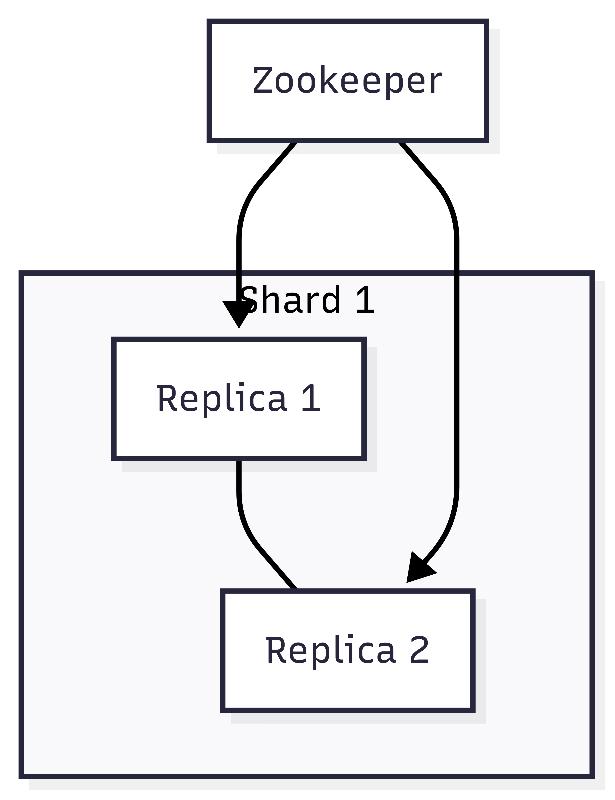

During the previous 28 days, we explored ClickHouse's internal design in depth, including the MergeTree engine, indexing, query optimization techniques, and the role different engines play in data processing. All of that was from the perspective of a **single machine or a single node**. But once we want to put ClickHouse into a **real production environment** and deal with high concurrency, data growth, and high availability, the deployment strategy becomes very important.

Traditional deployment methods, such as installing directly on a VM or bare metal, are simple, but they are no longer enough for modern cloud architectures. Kubernetes has become the de facto container orchestration standard, and it brings automation, elasticity, and scalability. The **ClickHouse Operator** makes it much easier to manage a complex ClickHouse cluster on Kubernetes.

This article uses minikube and the ClickHouse Operator on a single host to quickly simulate a distributed Kubernetes deployment.

## Why deploy ClickHouse on Kubernetes?

ClickHouse is already very fast by design, but as the amount of data and the number of users grow, a single node can no longer handle all the load. We need:

* **High availability (HA)**
  * If a node fails, the system can fail over automatically without interrupting queries.
* **Horizontal scalability**
  * When data grows from 100GB to several TB or even PB scale, we can expand the cluster and distribute the load quickly.
* **Automated operations**
  * Deployment, upgrades, monitoring, and rolling updates can all be automated through Kubernetes.
* **Cloud-native integration**
  * Kubernetes is built around APIs. Monitoring (Prometheus), storage (PVC), and networking (Ingress / Service) can all work smoothly with ClickHouse.

That is exactly the problem the ClickHouse Operator is designed to solve.

## Core concepts of the ClickHouse Operator

The ClickHouse Operator is a Kubernetes Operator maintained by [Altinity](https://github.com/Altinity) and the open source community: [Altinity/clickhouse-operator](https://github.com/Altinity/clickhouse-operator).

::github{repo="Altinity/clickhouse-operator"}

Its main features include:

* **Cluster CRD (Custom Resource Definition)**: define clusters in YAML, including shards, replicas, storage, and resources.
* **Automated management**: create, upgrade, delete, and rolling-update nodes.
* **High availability support**: support Replicated Tables through ZooKeeper or Keeper.
* **Monitoring integration**: automatically export metrics to Prometheus.

Architecturally, the Operator watches the ClickHouseCluster resources in Kubernetes. Once it detects a change, such as adding a replica, it automatically adjusts the underlying StatefulSet and Pods so that the cluster state matches the declarative configuration.

## Cloud deployment architecture

In the cloud, we usually design an architecture with the following characteristics:

* **Shards + replicas**
  * Shard: distributes data across different nodes to reduce storage pressure
  * Replica: creates copies for each shard to provide high availability
  * In this demo, we use a 1 shard, 2 replica setup
* **ZooKeeper / Keeper coordination**
  * Coordinates consistency for the cluster, including replicated tables and shard metadata
  * In this demo, we use 3 ZooKeeper nodes
* **Persistent Volume Claims (PVC)**
  * Ensures data is not lost after a node restart
  * In this demo, we use `emptyDir` because it is only a demo and the data will be deleted when the cluster is shut down
* **Resource allocation**
  * CPU and memory limits to prevent contention with other workloads

Example architecture diagram:



> The diagram is a bit large...

This setup ensures that:

* Query traffic does not stop if any replica goes down
* When data grows, you can scale out by adding new shards

## Hands-on implementation

Before creating the distributed table, there are a few prerequisites:

1. Install [minikube](https://minikube.sigs.k8s.io/docs/start/?arch=%2Fwindows%2Fx86-64%2Fstable%2F.exe+download). I used WSL2 with Ubuntu 24.04.2 LTS.
   * After installation, you can optionally run `minikube dashboard` to open a GUI.
2. Install the [ClickHouse Operator](https://github.com/Altinity/clickhouse-operator/blob/master/docs/operator_installation_details.md)
   * I only needed to run the command below. If you want the details, the documentation explains which components get deployed.
   ```bash
   kubectl apply -f https://raw.githubusercontent.com/Altinity/clickhouse-operator/master/deploy/operator/clickhouse-operator-install-bundle.yaml
   ```
3. Create a namespace to isolate the environment:
```bash
kubectl create namespace zoo3ns
```
4. Deploy a three-node ZooKeeper cluster. Add the following file:

```yaml
# zookeeper-3-nodes.yaml
# Setup Service to provide access to Zookeeper for clients
apiVersion: v1
kind: Service
metadata:
  # DNS would be like zookeeper.zoons
  name: zookeeper
  labels:
    app: zookeeper
spec:
  ports:
    - port: 2181
      name: client
    - port: 7000
      name: prometheus
  selector:
    app: zookeeper
    what: node
---
# Setup Headless Service for StatefulSet
apiVersion: v1
kind: Service
metadata:
  # DNS would be like zookeeper-0.zookeepers.etc
  name: zookeepers
  labels:
    app: zookeeper
spec:
  ports:
    - port: 2888
      name: server
    - port: 3888
      name: leader-election
  clusterIP: None
  selector:
    app: zookeeper
    what: node
---
# Setup max number of unavailable pods in StatefulSet
apiVersion: policy/v1
kind: PodDisruptionBudget
metadata:
  name: zookeeper-pod-disruption-budget
spec:
  selector:
    matchLabels:
      app: zookeeper
  maxUnavailable: 1
---
# Setup Zookeeper StatefulSet
# Possible params:
# 1. replicas
# 2. memory
# 3. cpu
# 4. storage
# 5. storageClassName
# 6. user to run app
apiVersion: apps/v1
kind: StatefulSet
metadata:
  # nodes would be named as zookeeper-0, zookeeper-1, zookeeper-2
  name: zookeeper
  labels:
    app: zookeeper
spec:
  selector:
    matchLabels:
      app: zookeeper
  serviceName: zookeepers
  replicas: 3
  updateStrategy:
    type: RollingUpdate
  podManagementPolicy: OrderedReady
  template:
    metadata:
      labels:
        app: zookeeper
        what: node
      annotations:
        prometheus.io/port: '7000'
        prometheus.io/scrape: 'true'
    spec:
      affinity: {}
      containers:
        - name: kubernetes-zookeeper
          imagePullPolicy: IfNotPresent
          image: "docker.io/zookeeper:3.8.4"
          resources:
            requests:
              memory: "512M"
              cpu: "1"
            limits:
              memory: "4Gi"
              cpu: "2"
          ports:
            - containerPort: 2181
              name: client
            - containerPort: 2888
              name: server
            - containerPort: 3888
              name: leader-election
            - containerPort: 7000
              name: prometheus
          env:
            - name: SERVERS
              value: "3"

# See those links for proper startup settings:
# https://github.com/kow3ns/kubernetes-zookeeper/blob/master/docker/scripts/start-zookeeper
# https://clickhouse.yandex/docs/en/operations/tips/#zookeeper
# https://github.com/ClickHouse/ClickHouse/issues/11781
          command:
            - bash
            - -x
            - -c
            - |
              HOST=`hostname -s` &&
              DOMAIN=`hostname -d` &&
              CLIENT_PORT=2181 &&
              SERVER_PORT=2888 &&
              ELECTION_PORT=3888 &&
              PROMETHEUS_PORT=7000 &&
              ZOO_DATA_DIR=/var/lib/zookeeper/data &&
              ZOO_DATA_LOG_DIR=/var/lib/zookeeper/datalog &&
              {
                echo "clientPort=${CLIENT_PORT}"
                echo 'tickTime=2000'
                echo 'initLimit=300'
                echo 'syncLimit=10'
                echo 'maxClientCnxns=2000'
                echo 'maxTimeToWaitForEpoch=2000'
                echo 'maxSessionTimeout=60000000'
                echo "dataDir=${ZOO_DATA_DIR}"
                echo "dataLogDir=${ZOO_DATA_LOG_DIR}"
                echo 'autopurge.snapRetainCount=10'
                echo 'autopurge.purgeInterval=1'
                echo 'preAllocSize=131072'
                echo 'snapCount=3000000'
                echo 'leaderServes=yes'
                echo 'standaloneEnabled=false'
                echo '4lw.commands.whitelist=*'
                echo 'metricsProvider.className=org.apache.zookeeper.metrics.prometheus.PrometheusMetricsProvider'
                echo "metricsProvider.httpPort=${PROMETHEUS_PORT}"
                echo "skipACL=true"
                echo "fastleader.maxNotificationInterval=10000"
              } > /conf/zoo.cfg &&
              {
                echo "zookeeper.root.logger=CONSOLE"
                echo "zookeeper.console.threshold=INFO"
                echo "log4j.rootLogger=\${zookeeper.root.logger}"
                echo "log4j.appender.CONSOLE=org.apache.log4j.ConsoleAppender"
                echo "log4j.appender.CONSOLE.Threshold=\${zookeeper.console.threshold}"
                echo "log4j.appender.CONSOLE.layout=org.apache.log4j.PatternLayout"
                echo "log4j.appender.CONSOLE.layout.ConversionPattern=%d{ISO8601} - %-5p [%t:%C{1}@%L] - %m%n"
              } > /conf/log4j.properties &&
              echo 'JVMFLAGS="-Xms128M -Xmx4G -XX:ActiveProcessorCount=8 -XX:+AlwaysPreTouch -Djute.maxbuffer=8388608 -XX:MaxGCPauseMillis=50"' > /conf/java.env &&
              if [[ $HOST =~ (.*)-([0-9]+)$ ]]; then
                  NAME=${BASH_REMATCH[1]} &&
                  ORD=${BASH_REMATCH[2]};
              else
                  echo "Failed to parse name and ordinal of Pod" &&
                  exit 1;
              fi &&
              mkdir -pv ${ZOO_DATA_DIR} &&
              mkdir -pv ${ZOO_DATA_LOG_DIR} &&
              whoami &&
              chown -Rv zookeeper "$ZOO_DATA_DIR" "$ZOO_DATA_LOG_DIR" &&
              export MY_ID=$((ORD+1)) &&
              echo $MY_ID > $ZOO_DATA_DIR/myid &&
              for (( i=1; i<=$SERVERS; i++ )); do
                  echo "server.$i=$NAME-$((i-1)).$DOMAIN:$SERVER_PORT:$ELECTION_PORT" >> /conf/zoo.cfg;
              done &&
              if [[ $SERVERS -eq 1 ]]; then
                  echo "group.1=1" >> /conf/zoo.cfg;
              else
                  echo "group.1=1:2:3" >> /conf/zoo.cfg;
              fi &&
              for (( i=1; i<=$SERVERS; i++ )); do
                  WEIGHT=1
                  if [[ $i == 1 ]]; then
                    WEIGHT=10
                  fi
                  echo "weight.$i=$WEIGHT" >> /conf/zoo.cfg;
              done &&
              zkServer.sh start-foreground
          readinessProbe:
            exec:
              command:
                - bash
                - -c
                - '
                  IFS=;
                  MNTR=$(exec 3<>/dev/tcp/127.0.0.1/2181 ; printf "mntr" >&3 ; tee <&3; exec 3<&- ;);
                  while [[ "$MNTR" == "This ZooKeeper instance is not currently serving requests" ]];
                  do
                    echo "wait mntr works";
                    sleep 1;
                    MNTR=$(exec 3<>/dev/tcp/127.0.0.1/2181 ; printf "mntr" >&3 ; tee <&3; exec 3<&- ;);
                  done;
                  STATE=$(echo -e $MNTR | grep zk_server_state | cut -d " " -f 2);
                  if [[ "$STATE" =~ "leader" ]]; then
                    echo "check leader state";
                    SYNCED_FOLLOWERS=$(echo -e $MNTR | grep zk_synced_followers | awk -F"[[:space:]]+" "{print \$2}" | cut -d "." -f 1);
                    if [[ "$SYNCED_FOLLOWERS" != "0" ]]; then
                      ./bin/zkCli.sh ls /;
                      exit $?;
                    else
                      exit 0;
                    fi;
                  elif [[ "$STATE" =~ "follower" ]]; then
                    echo "check follower state";
                    PEER_STATE=$(echo -e $MNTR | grep zk_peer_state);
                    if [[ "$PEER_STATE" =~ "following - broadcast" ]]; then
                      ./bin/zkCli.sh ls /;
                      exit $?;
                    else
                      exit 1;
                    fi;
                  else
                    exit 1;
                  fi
                   '
            initialDelaySeconds: 15
            periodSeconds: 10
            timeoutSeconds: 60
          livenessProbe:
            exec:
              command:
                - bash
                - -xc
                - 'date && OK=$(exec 3<>/dev/tcp/127.0.0.1/2181 ; printf "ruok" >&3 ; IFS=; tee <&3; exec 3<&- ;); if [[ "$OK" == "imok" ]]; then exit 0; else exit 1; fi'
            initialDelaySeconds: 10
            periodSeconds: 30
            timeoutSeconds: 5
          volumeMounts:
            - name: datadir-volume
              mountPath: /var/lib/zookeeper
      # Run as a non-privileged user
      securityContext:
        runAsUser: 1000
        fsGroup: 1000
      volumes:
        - name: datadir-volume
          emptyDir:
            medium: "" #accepted values:  empty str (means node's default medium) or Memory
            sizeLimit: 1Gi
```
    
Next, apply the manifest and verify that ZooKeeper was created successfully:
    
```bash
# Apply the configuration
kubectl apply -f zookeeper-3-nodes.yaml -n zoo3ns

# Check services
kubectl get svc -n zoo3ns
NAME        TYPE        CLUSTER-IP          EXTERNAL-IP   PORT(S)            AGE
zookeeper   ClusterIP   {YOUR-CLUSTER-IP}   <none>        2181/TCP,7000/TCP  54m
zookeepers  ClusterIP   None                <none>        2888/TCP,3888/TCP  54m

# Check pods
kubectl get pod -n zoo3ns
NAME            READY   STATUS    RESTARTS   AGE
zookeeper-0     1/1     Running   0          53m
zookeeper-1     1/1     Running   0          53m
zookeeper-2     1/1     Running   0          52m
```

5. Deploy ClickHouse with 1 shard and 2 replicas
```yaml
# clickhouse-1shards-2replicas.yaml
apiVersion: "clickhouse.altinity.com/v1"
kind: "ClickHouseInstallation"

metadata:
  name: "repl-05"

spec:
  defaults:
    templates:
      dataVolumeClaimTemplate: default
      podTemplate: clickhouse-20.7

  configuration:
    zookeeper:
      nodes:
      - host: zookeeper.zoo3ns
    clusters:
      - name: replicated
        layout:
          shardsCount: 1
          replicasCount: 2

  templates:
    volumeClaimTemplates:
      - name: default
        spec:
          accessModes:
            - ReadWriteOnce
          resources:
            requests:
              storage: 500Mi
    podTemplates:
      - name: clickhouse-20.7
        spec:
          containers:
            - name: clickhouse-pod
              image: clickhouse/clickhouse-server:24.8
```

Then apply the manifest and verify that ZooKeeper was created successfully:
```bash
# Apply the configuration
kubectl apply -f clickhouse-1shards-2replicas.yaml -n zoo3ns

# Check services
kubectl get svc -n zoo3ns
NAME                         TYPE        CLUSTER-IP      EXTERNAL-IP   PORT(S)                      AGE
chi-repl-05-replicated-0-0   ClusterIP   None            <none>        9000/TCP,8123/TCP,9009/TCP   50m
chi-repl-05-replicated-0-1   ClusterIP   None            <none>        9000/TCP,8123/TCP,9009/TCP   49m
clickhouse-repl-05           ClusterIP   None            <none>        8123/TCP,9000/TCP            49m

# Check pods
kubectl get pod -n zoo3ns
NAME                           READY   STATUS    RESTARTS   AGE
chi-repl-05-replicated-0-0-0   1/1     Running   0          50m
chi-repl-05-replicated-0-1-0   1/1     Running   0          50m
```

If everything is up, congratulations - you have completed the hardest part: **building the environment**.

6. Enter ClickHouse and test whether it works
    * Open two terminals and enter different Pods separately:
        ```bash
        kubectl exec -it chi-repl-05-replicated-0-0-0 -- bash
        kubectl exec -it chi-repl-05-replicated-0-1-0 -- bash
        ```
    * After entering, run `clickhouse-client`
    * Inside the `chi-repl-05-replicated-0-0-0` Pod, create `ReplicatedMergeTree`. This MergeTree engine helps synchronize data across different clusters, shards, and replicas automatically.

    ```sql
    CREATE TABLE events_local ON CLUSTER `{cluster}`
    (
        `event_date` Date,
        `event_type` Int32,
        `article_id` Int32,
        `title` String
    )
    ENGINE = ReplicatedMergeTree('/clickhouse/{installation}/{cluster}/tables/{shard}/{database}/{table}', '{replica}')
    PARTITION BY toYYYYMM(event_date)
    ORDER BY (event_type, article_id)
    ```
    If you get a result, it means the table was created successfully.
    ```sql
    Query id: 0e9d3beb-59ea-4194-9dbe-9f7cf88e19cc

    ┌─host───────────────────────┬─port─┬─status─┬─error─┬─num_hosts_remaining─┬─num_hosts_active─┐
    1. │ chi-repl-05-replicated-0-0 │ 9000 │      0 │       │                   1 │                0 │
    2. │ chi-repl-05-replicated-0-1 │ 9000 │      0 │       │                   0 │                0 │
    └────────────────────────────┴──────┴────────┴───────┴─────────────────────┴──────────────────┘

    2 rows in set. Elapsed: 0.253 sec.
    ```
    * Then create the local table

    ```sql
    CREATE TABLE events ON CLUSTER `{cluster}` AS events_local
    ENGINE = Distributed('{cluster}', default, events_local, rand())
    ```

    If you get a result, it means the table was created successfully.

    ```sql
    Query id: b203ec4b-08b1-45bf-98ea-6d4ad32956d8

    ┌─host───────────────────────┬─port─┬─status─┬─error─┬─num_hosts_remaining─┬─num_hosts_active─┐
    1. │ chi-repl-05-replicated-0-0 │ 9000 │      0 │       │                   1 │                0 │
    2. │ chi-repl-05-replicated-0-1 │ 9000 │      0 │       │                   0 │                0 │
    └────────────────────────────┴──────┴────────┴───────┴─────────────────────┴──────────────────┘

    2 rows in set. Elapsed: 0.084 sec.
    ```

    * Next, insert data in `chi-repl-05-replicated-0-0-0` and check whether it is synchronized in `chi-repl-05-replicated-0-1-0`
        * First, observe from `chi-repl-05-replicated-0-1-0`. Seeing no data is expected:
        ```sql
        SELECT *
        FROM events_local
        WHERE event_type = 100

        Query id: 4dd7fbbd-4089-4b7a-aa16-af78baeaf3f4

        Ok.

        0 rows in set. Elapsed: 0.002 sec.
        ```
        * Insert data on `chi-repl-05-replicated-0-0-0`
        ```sql
        INSERT INTO events VALUES (today(), 100, 123, 'from pod A');
        ```
        * Go back to `chi-repl-05-replicated-0-1-0` and check again:
        ```sql
        SELECT *
        FROM events_local
        WHERE event_type = 100

        Query id: 1537f542-a13d-4a19-b29b-baed69b476c8

        ┌─event_date─┬─event_type─┬─article_id─┬─title──────┐
        1. │ 2025-08-28 │        100 │        123 │ from pod A │
        └────────────┴────────────┴────────────┴────────────┘

        1 row in set. Elapsed: 0.002 sec.
        ```

At this point everything is correct, which means you succeeded!!! (Although it was only on a single node.)

## Deployment challenges and solutions

Even with the Operator, there are still some challenges:

* **Storage management**
  * PVC sizes need to be planned in advance, otherwise later adjustments are painful.
  * Solution: use a StorageClass that supports dynamic expansion.

* **Upgrade strategy**
  * A direct upgrade may cause nodes to become inconsistent.
  * Solution: use Rolling Update and make sure the table engine is Replicated-based.

* **Monitoring and observability**
  * When query performance drops, you need to diagnose quickly.
  * Solution: combine Prometheus + Grafana to monitor query latency, merge counts, and disk usage.

* **Network and traffic distribution**
  * Multi-shard queries need to go through a Distributed Table or an external load balancer.
  * Solution: Kubernetes Ingress + ClickHouse Distributed Engine.

## Difference from traditional VM deployment

| Aspect | VM / bare-metal deployment | Kubernetes deployment |
| --- | --- | --- |
| Deployment style | Manual installation and configuration | YAML-based and automated |
| Scaling | Manually add machines and adjust settings | Just change replicas or shards |
| High availability | ZooKeeper must be managed manually | Operator coordinates it automatically |
| Upgrades | Often require downtime | Rolling updates and zero downtime |
| Monitoring | Installed separately | Integrated with Prometheus / Grafana |

The conclusion is clear: if you are just testing on a single machine, VM deployment is enough. But if you want to move into production, Kubernetes + Operator is almost the standard choice.

## Conclusion

ClickHouse itself is very powerful, but without a good deployment strategy, you can still run into node failures, poor scalability, and difficult upgrades. The combination of Kubernetes and the ClickHouse Operator gives us:

* **Declarative configuration (YAML)** for managing the whole cluster
* Automated **deployment, upgrades, and scaling**
* High availability and fault tolerance for cloud-scale analytics

As data keeps growing, this kind of cloud-native deployment has become the preferred choice for production ClickHouse environments.

Tomorrow is the last day of the ClickHouse series :D


### ClickHouse series updates:

1. [ClickHouse Series: What is ClickHouse? The difference between OLAP and OLTP databases](https://blog.vicwen.app/posts/what-is-clickhouse/)
2. [ClickHouse Series: Why does ClickHouse choose column-based storage? The core difference between row-based and column-based storage](https://blog.vicwen.app/posts/clickhouse-column-row-based-storage/)
3. [ClickHouse Series: ClickHouse storage engine - MergeTree](https://blog.vicwen.app/posts/clickhouse-mergetree-engine)
4. [ClickHouse Series: How compression techniques and Data Skipping Indexes dramatically speed up queries](https://blog.vicwen.app/posts/clickhouse-compression-skipping-index/)
5. [ClickHouse Series: ReplacingMergeTree and data deduplication](https://blog.vicwen.app/posts/clickhouse-replacingmergetree-deduplication/)
6. [ClickHouse Series: Use cases for aggregating data with SummingMergeTree](https://blog.vicwen.app/posts/clickhouse-summingmergetree-aggregation/)
7. [ClickHouse Series: Real-time aggregation with Materialized Views](https://blog.vicwen.app/posts/clickhouse-materialized-view/)
8. [ClickHouse Series: Partitioning strategies and how Partition Pruning works](https://blog.vicwen.app/posts/clickhouse-partition-pruning/)
9. [ClickHouse Series: How Primary Key, Sorting Key, and Granule indexes work](https://blog.vicwen.app/posts/clickhouse-primary-sorting-key/)
10. [ClickHouse Series: CollapsingMergeTree and best practices for logical deletes](https://blog.vicwen.app/posts/clickhouse-collapsingmergetree/)
11. [ClickHouse Series: VersionedCollapsingMergeTree version control and conflict resolution](https://blog.vicwen.app/posts/clickhouse-versioned-collapsingmergetree/)
12. [ClickHouse Series: Advanced use of AggregatingMergeTree for real-time metrics](https://blog.vicwen.app/posts/clickhouse-aggregatingmergetree/)
13. [ClickHouse Series: Distributed Table and distributed query architecture](https://blog.vicwen.app/posts/clickhouse-distributed-table-architecture/)
14. [ClickHouse Series: High availability and zero-downtime upgrades with Replicated Tables](https://blog.vicwen.app/posts/clickhouse-replication-failover/)
15. [ClickHouse Series: Building a real-time data streaming pipeline with Kafka](https://blog.vicwen.app/posts/clickhouse-kafka-data-streaming-pipeline/)
16. [ClickHouse Series: Best practices for batch import (CSV, Parquet, Native Format)](https://blog.vicwen.app/posts/clickhouse-batch-import/)
17. [ClickHouse Series: Integrating ClickHouse with external data sources (PostgreSQL)](https://blog.vicwen.app/posts/clickhouse-external-data-integration/)
18. [ClickHouse Series: How to improve query performance? Using system.query_log and EXPLAIN](https://blog.vicwen.app/posts/clickhouse-query-log-explain/)
19. [ClickHouse Series: Advanced query acceleration with Projections](https://blog.vicwen.app/posts/clickhouse-projections-optimization/)
20. [ClickHouse Series: Sampling queries and statistical techniques](https://blog.vicwen.app/posts/clickhouse-sampling-statistics/)
21. [ClickHouse Series: TTL data cleanup and storage cost optimization](https://blog.vicwen.app/posts/clickhouse-ttl-storage-management/)
22. [ClickHouse Series: Storage Policies and tiered disk strategies](https://blog.vicwen.app/posts/clickhouse-storage-policies/)
23. [ClickHouse Series: Table design and storage optimization details](https://blog.vicwen.app/posts/clickhouse-schemas-storage-improvement/)
24. [ClickHouse Series: Integrating Grafana for visual monitoring](https://blog.vicwen.app/posts/clickhouse-grafana-dashboard/)
25. [ClickHouse Series: Query optimization case studies](https://blog.vicwen.app/posts/clickhouse-select-optimization/)
26. [ClickHouse Series: Integrating with BI tools (Power BI)](https://blog.vicwen.app/posts/clickhouse-bi-integration/)
27. [ClickHouse Series: Comparing ClickHouse Cloud and self-hosted deployments](https://blog.vicwen.app/posts/clickhouse-cloud-vs-self-host/)
28. [ClickHouse Series: Database security and RBAC implementation](https://blog.vicwen.app/posts/clickhouse-security-rbac/)
29. [ClickHouse Series: Deploying distributed architecture on Kubernetes](https://blog.vicwen.app/posts/clickhouse-operator-kubernates/)
30. [ClickHouse Series: Looking at the six core mechanisms of MergeTree from source code](https://blog.vicwen.app/posts/clickhouse-mergetree-sourcecode-introduction/)
