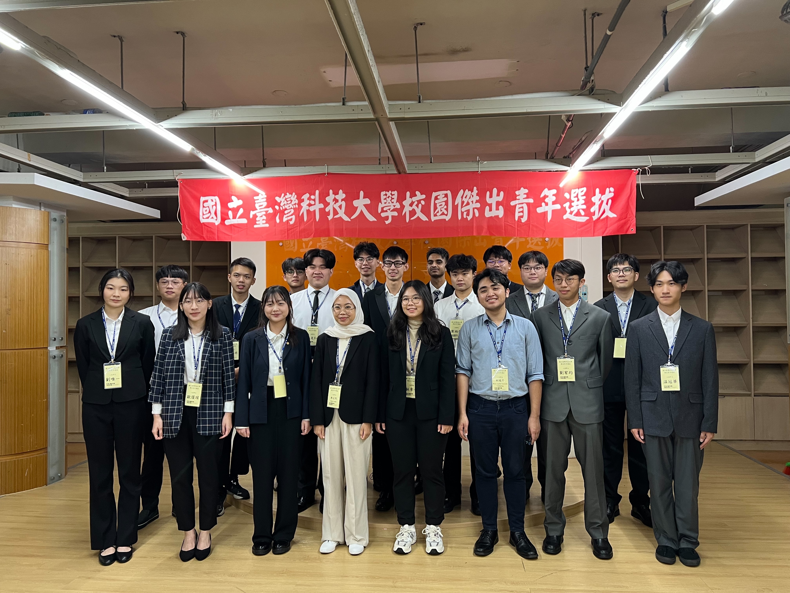

This post is mainly here to document my experience applying for both the college-level and university-level Outstanding Youth awards, and to leave some preparation ideas behind for the people who come after me~
If you’re interested in competing for this honor on campus and still have questions after reading this post, feel free to DM me on Instagram. I’ll help answer whatever I can! (Please be polite ✨)

# Why I Wanted to Apply

I applied back in my freshman year. Honestly, Siyuan was the one who said to me, “Hey Vic, Outstanding Youth, want to go for it?”
And I said, “Sure, let’s pick one.”

There wasn’t any grand dream behind it.

Then I looked at the eligibility requirements and realized I fit them pretty well, and they matched my experience quite closely, so I decided to run.

Personally, I think the Outstanding Youth title is both an honor and a channel that helps you broaden your horizons and meet other outstanding people. And because the school’s selection process is very strict, the university-level award only selects **0.1% (12/12000)** of students, so the competition is very intense.

## Benefits?

There are roughly a few:
1. There is a fixed Outstanding Youth gathering every year 🎈
2. There is a LINE community that gathers Outstanding Youth awardees from all NTUST departments, and there are even professors and company founders in it
3. ~You get to secretly show off that you’re Outstanding Youth~

After all, it’s a title. But through this program, you get to know the older Outstanding Youth awardees. Because I connected with one senior who worked at Google, it actually **led to two Google company visits for our club**~ That senior really helped me a lot as a younger student.

# How I Prepared for the College-Level Award

I’d recommend using that year’s evaluation checklist as a reference:

1. Participated in club activities with outstanding performance and concrete achievements
2. Enthusiastically engaged in public service and social service work with outstanding performance and concrete achievements
3. Participated in international or national competitions with outstanding performance and concrete achievements
4. Participated in academic research or performed outstandingly in literature, arts, sports, and so on, with concrete achievements
5. Studied diligently and achieved outstanding results, serving as a model for young students
6. Other concrete achievements sufficient to serve as a model for young students

So I roughly broke my preparation into: **public service, academics, character, clubs, and competitions**. Of course, from what I observed, most Outstanding Youth awardees do not have all of these. They usually go deep in a few specific areas. But if you **only qualify in three areas**, you will definitely get filtered out. Please evaluate yourself carefully. Even if you have to stretch a little, make sure you can at least stretch it to four.

For my own application, I focused on:
1. Serving as President of Google Developer Student Clubs and President of the Computer Science Department Student Association
2. Founding leader of the New Taipei Ruifang Interact Club from 2018 to 2024, foundation volunteer mentor, and various other volunteer experiences
3. Champion of the Computer Repair category in the Industrial Technology Competition
4. Showing off my GPA and academic excellence awards XD
5. Bringing up my family background
6. Basically writing down anything I could talk about, though it still had to be something substantial

Because the first stage was the college-level Outstanding Youth selection, the application form was just written in bullet points, so I didn’t deliberately polish my wording too much. The real key was the interview, because that determined whether you got a ticket to the second stage.
Before the interview, you would also prepare slides, so that’s when you could explain the details more thoroughly in person.

It’s also a good time to think about your own strengths and weaknesses, and how you want to introduce yourself to the committee during the interview.

At the time, I first introduced most of my experiences, quickly breaking them down into the areas above. Then I moved into my family background and difficult study environment, and finally used that as a turn to bring out my unwillingness to lose, my perseverance, and a few of the public service projects I had worked on.

And of course, I ended with my personal motto. To be honest, it was kind of cringe, but it seemed to work XD.

# How I Prepared for the University-Level Award

When I found out I had successfully advanced from 9 candidates down to 3, I was genuinely relieved. I was the youngest one there, and everyone else had very strong backgrounds, so I was quite afraid I would get eliminated in the first stage.

Next came the real competition against the college-level awardees from across the entire university. Before the interview, we received some sample questions:
1. Self-introduction, and who is the person you are most grateful to?
2. What is the most special contribution you remember making?
3. What qualities do you think an Outstanding Youth awardee should have?
4. What achievements, abilities, or talents of yours are moving enough for others to see you as outstanding?
5. What are your future ambitions?
6. If you are elected as Outstanding Youth, what ideas or actions would you have to help this activity expand its influence even further? (Passing things on and pursuing excellence)

But aside from the first one, I was only actually asked question 5. Some people were not asked any of the sample questions at all XD.
Most of the judges simply continued asking based on the autobiography and self-introduction you submitted. In my case, I was asked mostly about my growth environment, how I maintained that mindset, and my public service projects.
There was one question that I found especially thought-provoking, so if you have thoughts, you can think about it too:

> What do you believe the definition of “outstanding” is, and how is it reflected in daily life?

The atmosphere during my interview was actually pretty friendly. Overall, it was a good experience, and there was even lunch. I also took the opportunity to meet some of the other candidates during the breaks. They were all my seniors 😭, and every single one of them was incredibly impressive. It made me want to become someone like them.

# Reflections & Suggestions

People often ask me:

> Vic, what changed after you got the title of double Outstanding Youth?

**I can say that almost nothing changed.** Life went on as usual, and I was still just an ordinary student. It wasn’t like adding one more title suddenly put me at the peak of life. The most important thing is still your everyday mindset. When I observed the older Outstanding Youth awardees, I realized that the quality of being “outstanding” is not something they deliberately show off. It is the accumulation of their daily results, and it naturally appears in the way they act and carry themselves.

I do have a few thoughts of my own. In bullet form, they would be:
1. A title can create influence, but how will you use that influence to affect others?
3. Even if you are not all-rounded, how deeply have you cultivated the field you are best at?
2. "**Outstanding**" is not something you perform on purpose. It should feel natural, so just stay grounded.

Finally, if you read the guidelines carefully, you’ll notice something important: if you are selected as a college-level Outstanding Youth but unfortunately do not get selected at the university-level stage, then you are **not eligible to apply again**.
So if you are still young and haven’t accumulated enough experience yet, there is no need to rush into applying. People like me, who got selected at such an early stage, are very rare across nineteen years of the award’s history. Everyone should really evaluate carefully before choosing to apply ✌️, unless you only want the college-level title.

I didn’t even realize that rule until I had already advanced to the university-level stage. Terrifying 💀

Let’s end this memory with a photo from the university-level interview day~

