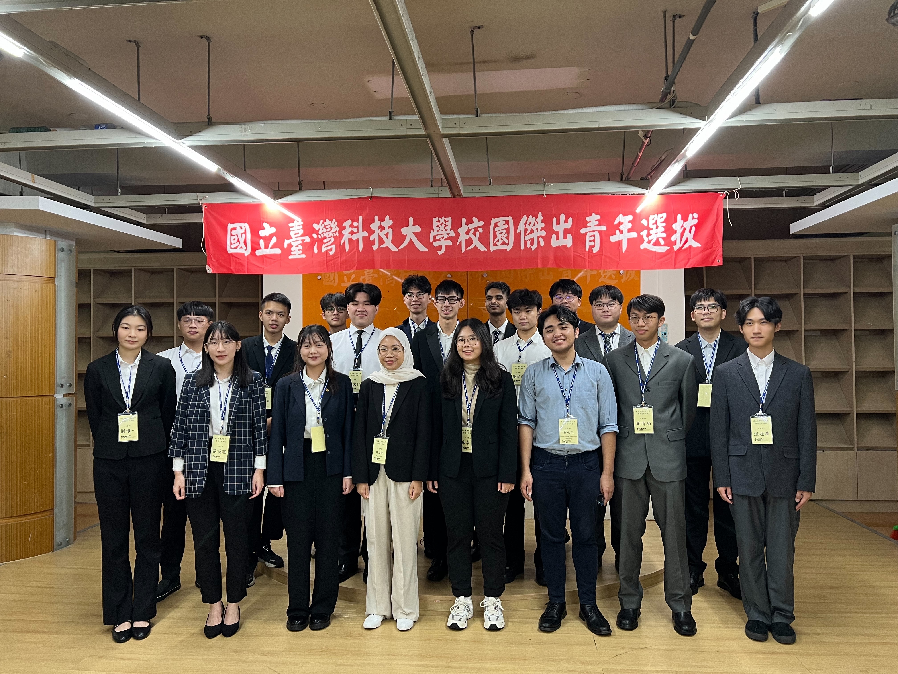

這篇文章主要是想紀錄自己當初申請院傑青和校傑青的歷程，以及留一些當初準備的方向給後面的人～
如果你對於爭取校內傑出青年榮譽有意願，看完文章如果仍然有疑問，歡迎私訊我的 Instagram，能回答的我都會幫忙解答！（要有禮貌喔 ✨）

# 為何想申請傑出青年

我當時申請是大一的時候，其實是思遠跟我說：「欸Vic，傑青欸要不要選一下」
我就說：「好啊，選一個。」

也沒有什麼宏大的夢想。

再來就是看了看申請資格，內容我都有符合，突然發現跟我的經驗滿吻合的，於是便出來參選了。

個人認為傑青像是個稱號，也是個幫助你擴展自身眼界，接觸到其他優秀的人的一個渠道！尤其又經過學校的嚴格篩選，校傑可是只選 **0.1%（12/12000）**，也是競爭非常激烈的呢。

## 好處？

大致有以下幾項：
1. 每屆都固定會有一次傑青聚會 🎈
2. 集結台科各科系的傑青 LINE 社群，裡面不乏有已經當教授、公司大老闆的存在
3. ~你可以偷偷炫耀自己是傑青~

畢竟這就是一個稱號，讓你透過這個 Program 認識到其他的傑青長姊們，我就有因為和一位在 Google 的傑青學長聯繫，**促成兩次社團內的 Google 企業參訪**～學長真的在這之中幫助我這個小學弟很多。

# 院傑出準備歷程

建議可以參照當年度的評估勾選表作爲參考：

1. 參與社團活動，表現優異，有具體事蹟者。
2. 熱心公益，推展社會服務工作，表現優異，有具體事蹟者。
3. 參與國際或全國性競賽活動，表現優異，有具體事蹟者。
4. 參與學術研究或在文學、藝術、體育等方面，表現優異，有具體事蹟者。
5. 刻苦向學，卓然有成，足為青年學生楷模者。
6. 其他足資為青年學生楷模有具體事蹟者

所以我大致拆分為：**公益、學術、品德、社團、競賽**去做準備，當然我觀察大部分傑青都不會全部具備，而是深耕於特定幾個項目，但如果你**只有符合其中 3 項**，你一定會被刷下來，請評估自身能力，即使要掰也要至少掰到四項喔。

我自身申請是著重：
1. 接任 Google 學生開發者社群社長 & 資工系系學會會長
2. 2018-2024 新北瑞芳扶少團創團團長 & 基金會輔導志工 & 一些七七八八的志工經驗
3. 工科賽電修職種冠軍
4. 拿 GPA 和書卷出來招搖撞騙 XD
5. 拿家庭背景出來說
6. 反正能拿出來講的都寫上去就對了，但還是要有料的再寫上去

因為一開始是先選院傑出青年，申請表只有單純用條列式去撰寫，所以也沒有刻意去雕用字遣詞，主要還是在面試環節決定是否有第二階段的門票～
到時候面試前也會讓你準備簡報，可以把詳細資訊再面談告知。

也可以在這時候思考一下自己的優點、缺點，面試時該如何和評審委員介紹自己。

我當時是先介紹自己的大多數經歷，拆分成上面幾個區塊快速帶過，接著帶到家庭和讀書環境的窘境，最後轉折帶出不服輸、堅毅的性格，以及最後帶出曾經做過的幾個公益項目。

我當然最後是用座右銘作為結尾，說實在滿中二的，但好像滿有效果的 XD

# 校傑出準備歷程

當收到自己 9 取 3 有成功晉級的消息，真的鬆了口氣，當時我最小，大家的經歷都很強，滿怕自己第一階段就被刷下去了。

接下來就是跟全校的院傑出一較高下了，在面談前有收到參考提問：
1. 自我介紹、最想感謝的人？
2. 記憶中最特殊的貢獻？
3. 你認為傑出青年應具備的條件？
4. 你認為你的何種事蹟(能力、才華)足以讓人感動或被認為傑出？
5. 未來有何抱負？
6. 如果當選了傑出青年，有無什麼想法或作為，能讓此活動更能擴大
其影響力？(承先啟後追求卓越)

但除了第一項以外，我只有被問到第 5 項，甚至有人完全沒被問到上面的 XD
幾乎都是評審委員基於你給的自傳、自我介紹繼續提問，我當時幾乎都被問到生長環境、如何保持這樣的心態、公益項目為主，
有題我覺得滿耐人尋味的，有想法的可以思考看看：

> 您認為「傑出」的定義是什麼？如何體現於日常？

我當時面談的氣氛算是挺和諧的，整體體驗還不錯（還有午餐吃），也有趁空檔多認識一些候選人，大家都是我的學長姐 😭，個個都超級優秀的，讓我很想成為像他們一樣的人。

# 心得 & 建議

大家常會問我：

> Vic 你拿到雙傑出青年的頭銜有什麼轉變嗎？

**我可以說幾乎沒有**，日子照樣過，我也還是個普通的學生，並沒有因為多了個頭銜而過上人生巔峰，最重要的還是在個人的平時心態，我觀察傑青的長姊們，發現「傑出」的特質並不是刻意展露的，而是平時的成果累積、一舉一動都是符合所謂的特質。

我自己是有一些心得，用條列式大概是：
1. 頭銜能製造影響力，那你如何透過影響力影響他人？
3. 即使你不是全方位的，那你是如何深耕於你擅長的領域？
2. 「**傑出**」並不是刻意展現的，而是渾然天成的，保持平常心吧！

最後，如果你仔細看簡章你會發現，如果你當選院傑出青年，但在校傑出青年階段不幸落選，你是**沒有資格再參加一次**囉，所以如果你還年輕，經歷還累積的不夠多，可以不用那麼急著申請喔，我這種二年級就當選的人，十九屆來屈指可數，各位選之前還是要審慎評估一下 ✌️（除非你只想拿院傑出）

我當時甚至是選到校傑出青年才知道這件事情，真可怕 💀

最後用當天面試校傑出的照片結束這個回憶吧~

